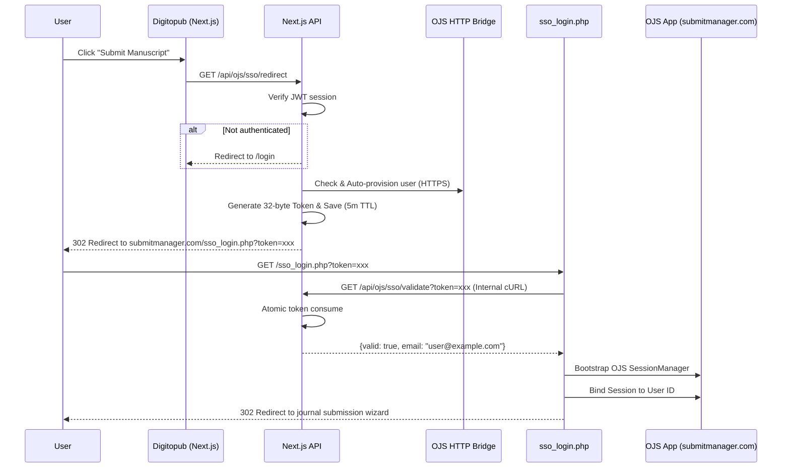

# DigitoPub.com - Scientific Publishing Platform

A comprehensive digital publishing platform for academic and scientific journals by DigitoPub, built with Next.js, Prisma, and MySQL.

[](https://vercel.com/azizwarpai-7979s-projects/v0-scientific-journals-website)

## 🌟 Features

- **Journal Management**: Create, edit, and manage scientific journals
- **Submission System**: Handle manuscript submissions with review workflow
- **OJS Integration**: Read-only integration with Open Journal Systems database
- **Admin Dashboard**: Comprehensive admin panel for managing content
- **Automated Sync**: Periodic synchronization with OJS database
- **MySQL Backend**: Production-ready MySQL database with optimized schema

## 🚀 Quick Start

### Prerequisites

- Node.js 18+ or Bun
- MySQL 8.0+ or MariaDB 10.2.7+
- (Optional) OJS 3.x installation for integration

### Installation

1. **Clone the repository**
   ```bash
   git clone <repository-url>
   cd scientific-journals-website
   ```

2. **Install dependencies**
   ```bash
   npm install
   # or
   bun install
   ```

3. **Set up environment variables**
   ```bash
   cp .env.example .env
   ```
   
   Edit `.env` and configure your database credentials:
   ```env
   DATABASE_HOST=localhost
   DATABASE_PORT=3306
   DATABASE_NAME=scientific_journals
   DATABASE_USER=app_user
   DATABASE_PASSWORD=your_password
   
   # Optional: OJS Integration
   OJS_DATABASE_HOST=localhost
   OJS_DATABASE_NAME=ojs_db
   OJS_DATABASE_USER=ojs_readonly
   OJS_DATABASE_PASSWORD=readonly_password
   ```

4. **Start MySQL with Docker** (Optional)
   ```bash
   docker-compose up -d
   ```
   
   This will start MySQL 8.0 with automatic schema initialization.

5. **Run database migrations** (if not using Docker)
   ```bash
   mysql -u app_user -p scientific_journals < scripts/001_create_tables.sql
   mysql -u app_user -p scientific_journals < scripts/002_insert_sample_data.sql
   ```

6. **Generate Prisma Client**
   ```bash
   npx prisma generate
   ```

7. **Start the development server**
   ```bash
   npm run dev
   ```
   
   Visit [http://localhost:3000](http://localhost:3000) to see your application.

## 📊 Database

This project uses **MySQL** (migrated from PostgreSQL) with the following key features:

- **BIGINT AUTO_INCREMENT** for primary keys
- **JSON fields** for arrays and complex data structures
- **Optimized indexes** for performance
- **Triggers** for automatic timestamp updates

### Database Scripts

```bash
# Verify MySQL connection
npm run db:verify

# Run migrations manually
npm run db:migrate

# Seed with sample data
npm run db:seed
```

## 🔗 OJS Integration

The platform integrates with Open Journal Systems (OJS) for read-only data access and single sign-on (SSO).

### SSO Authentication Flow



### Setup OJS Integration

1. **Create read-only MySQL user**
   ```sql
   CREATE USER 'ojs_readonly'@'localhost' IDENTIFIED BY 'password';
   GRANT SELECT ON ojs_db.* TO 'ojs_readonly'@'localhost';
   FLUSH PRIVILEGES;
   ```

2. **Test OJS connection**
   ```bash
   npm run ojs:verify
   ```

3. **Run initial sync**
   ```bash
   npm run ojs:sync
   ```

4. **Set up automated sync** (optional)
   ```bash
   # Add to crontab (runs every 6 hours)
   0 */6 * * * cd /path/to/app && bun run scripts/ojs-sync-cron.ts >> /var/log/ojs-sync.log 2>&1
   ```

### OJS Features

- ✅ Read journals, submissions, and publications
- ✅ Track review assignments and editorial decisions
- ✅ Access article metadata, authors, and citations
- ✅ View article statistics (views, downloads)
- ✅ Search published articles
- ❌ No write operations (read-only for safety)

## 🛠️ Development

### Available Scripts

```bash
# Development
npm run dev          # Start dev server
npm run build        # Build for production
npm run start        # Start production server

# Database
npm run db:migrate   # Run MySQL migrations
npm run db:seed      # Seed database
npm run db:verify    # Test database connection

# OJS Integration
npm run ojs:verify   # Test OJS connection
npm run ojs:sync     # Sync data from OJS

# Prisma
npm run prisma:generate  # Generate Prisma client
npx prisma studio        # Open Prisma Studio GUI
```

### Project Structure

```
scientific-journals-website/
├── app/                    # Next.js app directory
│   ├── admin/             # Admin dashboard pages
│   └── api/               # API routes
├── components/            # React components
├── lib/                   # Utility libraries
│   ├── ojs-client.ts     # OJS database client
│   ├── ojs-models.ts     # OJS TypeScript types
│   └── ojs-service.ts    # OJS business logic
├── prisma/
│   └── schema.prisma     # Prisma schema (MySQL)
├── scripts/
│   ├── 001_create_tables.sql      # Database schema
│   ├── 002_insert_sample_data.sql # Sample data
│   ├── ojs-sync-cron.ts           # OJS sync script
│   ├── verify-mysql-connection.ts # MySQL test
│   └── verify-ojs-connection.ts   # OJS test
└── docker-compose.yml    # MySQL Docker setup
```

## 📚 Documentation

- **[MIGRATION_README.md](./MIGRATION_README.md)** - Complete migration guide from PostgreSQL to MySQL
- **[Implementation Plan](./artifacts/implementation_plan.md)** - Technical migration details
- **[Walkthrough](./artifacts/walkthrough.md)** - Migration completion summary

## 🔐 Security

- Admin routes protected by authentication middleware
- OJS database access is read-only
- Environment variables for sensitive credentials
- SQL injection protection via parameterized queries
- Connection pooling for DoS prevention

## 📝 Migration Notes

This project was migrated from PostgreSQL to MySQL. Key changes:

| Feature | PostgreSQL | MySQL |
|---------|-----------|-------|
| Primary Keys | UUID | BIGINT AUTO_INCREMENT |
| Arrays | TEXT[] | JSON |
| JSON | JSONB | JSON |
| Timestamps | TIMESTAMPTZ | DATETIME |
| Auth | Row Level Security | Application-level |

## 🚨 Troubleshooting

### Database Connection Issues

```bash
# Test MySQL connection
npm run db:verify

# Check MySQL is running
docker-compose ps
# or
systemctl status mysql
```

### OJS Integration Issues

```bash
# Test OJS connection
npm run ojs:verify

# Check OJS credentials in .env
echo $OJS_DATABASE_HOST
```

### Prisma Issues

```bash
# Regenerate Prisma client
npx prisma generate

# Reset database (⚠️ deletes all data)
npx prisma migrate reset
```

## 🤝 Contributing

1. Fork the repository
2. Create your feature branch (`git checkout -b feature/amazing-feature`)
3. Commit your changes (`git commit -m 'Add amazing feature'`)
4. Push to the branch (`git push origin feature/amazing-feature`)
5. Open a Pull Request

## 📄 License

This project is private and proprietary.

## 🔗 Links

- **Production**: [Vercel Deployment](https://vercel.com/azizwarpai-7979s-projects/v0-scientific-journals-website)
- **OJS Documentation**: [PKP Documentation](https://docs.pkp.sfu.ca/)


**Built with ❤️ by DigitoPub using Next.js, Prisma, and MySQL**

