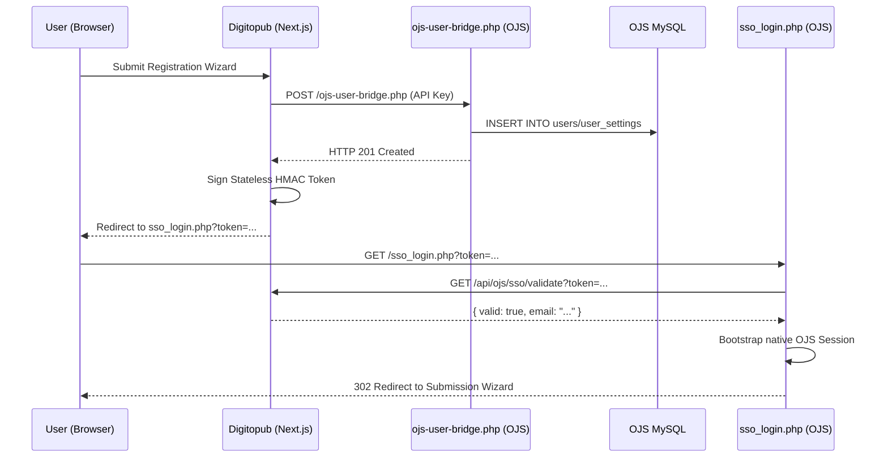

# DigitoPub.com - Scientific Publishing Platform

A comprehensive digital publishing platform for academic and scientific journals by DigitoPub, built with Next.js, Prisma, and MySQL.

[](https://digitopub.com)

## 🌟 Features

- **Journal Management**: Create, edit, and manage scientific journals
- **Submission System**: Handle manuscript submissions with review workflow
- **OJS Integration**: Read-only integration with Open Journal Systems database
- **Admin Dashboard**: Comprehensive admin panel for managing content
- **Automated Sync**: Periodic synchronization with OJS database
- **MySQL Backend**: Production-ready MySQL database with optimized schema

## 🚀 Quick Start

### Prerequisites

- Node.js 18+ or Bun
- MySQL 8.0+ or MariaDB 10.2.7+
- (Optional) OJS 3.x installation for integration

### Installation

1. **Clone the repository**
   ```bash
   git clone <repository-url>
   cd scientific-journals-website
   ```

2. **Install dependencies**
   ```bash
   npm install
   # or
   bun install
   ```

3. **Set up environment variables**
   ```bash
   cp .env.example .env
   ```
   
   Edit `.env` and configure your database credentials:
   ```env
   DATABASE_HOST=localhost
   DATABASE_PORT=3306
   DATABASE_NAME=scientific_journals
   DATABASE_USER=app_user
   DATABASE_PASSWORD=your_password
   
   # Optional: OJS Integration
   OJS_DATABASE_HOST=localhost
   OJS_DATABASE_NAME=ojs_db
   OJS_DATABASE_USER=ojs_readonly
   OJS_DATABASE_PASSWORD=readonly_password
   ```

4. **Start MySQL with Docker** (Optional)
   ```bash
   docker-compose up -d
   ```
   
   This will start MySQL 8.0 with automatic schema initialization.

5. **Run database migrations** (if not using Docker)
   ```bash
   mysql -u app_user -p scientific_journals < scripts/001_create_tables.sql
   mysql -u app_user -p scientific_journals < scripts/002_insert_sample_data.sql
   ```

6. **Generate Prisma Client**
   ```bash
   npx prisma generate
   # or
   bunx prisma generate
   ```

7. **Start the development server**
   ```bash
   npm run dev
   ```
   
   Visit [http://localhost:3000](http://localhost:3000) to see your application.

## 📊 Database

This project uses **MySQL** (migrated from PostgreSQL) with the following key features:

- **BIGINT AUTO_INCREMENT** for primary keys
- **JSON fields** for arrays and complex data structures
- **Optimized indexes** for performance
- **Triggers** for automatic timestamp updates

### Database Scripts

```bash
# Verify MySQL connection
npm run db:verify
# or
bun run db:verify

# Run migrations manually
npm run db:migrate
# or
bun run db:migrate

# Seed with sample data
npm run db:seed
# or
bun run db:seed
```

## 🔗 System Architecture Overview

The system operates across two strict boundaries:
- **digitopub.com (Gateway)**: A purely stateless, read-only Next.js storefront for displaying journal content. It has no user login forms and stores no user sessions.
- **submitmanager.com (OJS)**: The solitary identity provider and submission management interface. It owns all users, roles, and manuscript workflows.

### Authentication Model (amended by UIET-P1)

digitopub now holds TWO independent identity systems:

- **Admin authentication** (`auth_token` cookie, JWT via `jose`): unchanged. Used for `/admin/*` routes only. Helpers live in `src/lib/db/auth.ts`.
- **Public-user identity** (`digitopub_identity` cookie, HMAC-signed): added by UIET-P1. Used to gate non-OA PDF actions and attribute engagement events. ORCID is the SOLE identity provider — digitopub never sees passwords, never validates credentials, never stores email/password tuples. Helpers live in `src/lib/identity-cookie.ts`.

The two cookies are wholly separate code paths and MUST NOT cross-pollinate.

### Public-user identity (UIET-P1)

- **Sign in**: anonymous readers who try to view or download a non-OA PDF see a sign-in modal with a single "Sign in with ORCID" CTA. The OAuth flow round-trips through orcid.org and returns the user to the article.
- **Cookie**: `digitopub_identity` is HMAC-signed (`IDENTITY_COOKIE_SECRET`), 30 min sliding expiry, 8 h absolute expiry, ±2 min skew tolerance. Host-only on `digitopub.com`, `httpOnly; Secure; SameSite=Lax`.
- **OA awareness**: PDF view and download are gated only when `article.isOpenAccess === false`. Abstracts and citation export are always anonymous-allowed.
- **Server-side enforcement**: `/api/pdf-proxy` rejects non-OA requests without a valid identity cookie (401 with `WWW-Authenticate: orcid`).
- **OJS linkage**: on first ORCID login we link the iD to the matching OJS user (by ORCID iD first, then email). When `ENABLE_ORCID_OJS_BACKFILL=true`, we write the ORCID iD back into OJS `user_settings`. Every such write is audited in `audit_ojs_writes`. Default OFF in production.

### Engagement tracking

`user_event` rows are written for every view, download, and citation export. The `digitopub_consent` cookie controls what is recorded:

- `all` — orcid (when signed in), daily-rotating IP hash, daily-rotating UA hash.
- `essential_only` — orcid only; no IP/UA.
- `pre_consent` (no choice yet) — fully anonymous: source='pre_consent', no orcid, no IP/UA.

Aggregation crons live in `scripts/aggregate-daily-metrics.ts`, `aggregate-monthly-metrics.ts`, `update-user-metrics.ts`, and `retention-cleanup.ts`.

### Registration handover (unchanged)

Single Sign-On (SSO) for the registration path is still a **one-way token-based bootstrap** used exclusively after a new user registers on digitopub. The registration API provisions the user in OJS and redirects them with a 5-minute expiry HMAC token to log them securely into OJS the very first time. **SSO is not used for returning users.**

### Developer Rules (IMPORTANT)

- **NEVER** call `getSession()` or `jose.jwtVerify` in any public route (under `app/` excluding `app/admin/**`, or under `src/server/routes/`). The ESLint rule `no-restricted-imports` enforces this; CI greps as a backup.
- **ALWAYS** use `getIdentity(request)` from `src/lib/identity-cookie.ts` for public-user identity. It is sibling to admin auth, never invokes it.
- **NEVER** write to OJS outside of `writeOrcidToOjsWithAudit()` in `src/lib/ojs-write-guard.ts`. Every write produces an audit row.
- **ALWAYS** flag-gate new public-user surfaces behind `UIET_P1_ENABLED` until the rollout finishes.

### Common Mistakes

- 🚫 **using `getSession()` in a public route**: that is the admin pathway. Use `getIdentity()`.
- 🚫 **blocking submit behind identity**: submission flow is unchanged. The submit button never checks the identity cookie.
- 🚫 **writing to OJS without the guard**: every write must go through `writeOrcidToOjsWithAudit()` so it lands in `audit_ojs_writes`.

### Submission & Authentication Flow (Verified Architecture)

The system enforces a strict **Dual Authentication Model** where public users are isolated from the admin gateway.

#### 1. Registration Flow (New Users)
When a new user registers on digitopub, a secure backend-to-backend provisioning process occurs:

1. **Provisioning**: digitopub calls `ojs-user-bridge.php` on the OJS server via a Bearer-authenticated POST request.
2. **Identity Creation**: OJS creates the user record in its own MySQL database and assigns roles.
3. **JIT Handover**: digitopub generates a stateless HMAC token (`base64(payload).signature`) valid for 5 minutes.
4. **SSO Transition**: The user is redirected to `sso_login.php?token=...` on the OJS domain.
5. **Session Bootstrap**: `sso_login.php` validates the token via digitopub's `GET /api/ojs/sso/validate` and initializes a native OJS session.



#### 2. Submission Flow (Returning Users)
digitopub acts as a **purely stateless gateway** for returning users.

- **Direct Navigation**: Clicking "Submit Manuscript" generates a direct `<Link>` to the OJS submission wizard.
- **Identity Provider**: OJS handles all authentication. If the user is unauthenticated, OJS renders its own login form.
- **No Interference**: digitopub does not intercept the click, check local sessions, or issue SSO tokens for returning users.

#### Security Constraints
- **Sole IDP**: OJS is the solitary source of truth for public identity.
- **No Public Token Generation**: digitopub MUST NOT expose any public endpoint (e.g., `POST /api/ojs/sso`) that generates tokens based on client-provided emails.
- **Stateless Handover**: Registration handover is synchronous and JIT (Just-In-Time).

### Setup OJS Integration

1. **Create read-only MySQL user**
   ```sql
   CREATE USER 'ojs_readonly'@'localhost' IDENTIFIED BY 'password';
   GRANT SELECT ON ojs_db.* TO 'ojs_readonly'@'localhost';
   FLUSH PRIVILEGES;
   ```

2. **Test OJS connection**
   ```bash
   npm run ojs:verify
   # or
   bun run ojs:verify
   ```

3. **Run initial sync**
   ```bash
   npm run ojs:sync
   # or
   bun run ojs:sync
   ```

4. **Set up automated sync** (optional)
   ```bash
   # Add to crontab (runs every 6 hours)
   0 */6 * * * cd /path/to/app && bun run scripts/ojs-sync-cron.ts >> /var/log/ojs-sync.log 2>&1
   ```

### OJS Features

- ✅ Read journals, submissions, and publications
- ✅ Track review assignments and editorial decisions
- ✅ Access article metadata, authors, and citations
- ✅ View article statistics (views, downloads)
- ✅ Search published articles
- ❌ No write operations (read-only for safety)

## 🛠️ Development

### Available Scripts

```bash
# Development
npm run dev          # Start dev server (or bun run dev)
npm run build        # Build for production (or bun run build)
npm run start        # Start production server (or bun run start)

# Database
npm run db:migrate   # Run MySQL migrations (or bun run db:migrate)
npm run db:seed      # Seed database (or bun run db:seed)
npm run db:verify    # Test database connection (or bun run db:verify)

# OJS Integration
npm run ojs:verify   # Test OJS connection (or bun run ojs:verify)
npm run ojs:sync     # Sync data from OJS (or bun run ojs:sync)

# Prisma
npx prisma generate  # Generate Prisma client (or bunx prisma generate)
npx prisma studio    # Open Prisma Studio GUI (or bunx prisma studio)
```

### Project Structure

```
scientific-journals-website/
├── app/                    # Next.js app directory
│   ├── admin/             # Admin dashboard pages
│   └── api/               # API routes
├── components/            # React components
├── lib/                   # Utility libraries
│   ├── ojs-client.ts     # OJS database client
│   ├── ojs-models.ts     # OJS TypeScript types
│   └── ojs-service.ts    # OJS business logic
├── prisma/
│   └── schema.prisma     # Prisma schema (MySQL)
├── scripts/
│   ├── 001_create_tables.sql      # Database schema
│   ├── 002_insert_sample_data.sql # Sample data
│   ├── ojs-sync-cron.ts           # OJS sync script
│   ├── verify-mysql-connection.ts # MySQL test
│   └── verify-ojs-connection.ts   # OJS test
└── docker-compose.yml    # MySQL Docker setup
```

## 📚 Documentation

- **[MIGRATION_README.md](./MIGRATION_README.md)** - Complete migration guide from PostgreSQL to MySQL
- **[Implementation Plan](./artifacts/implementation_plan.md)** - Technical migration details
- **[Walkthrough](./artifacts/walkthrough.md)** - Migration completion summary

## 🔐 Security

- Admin routes protected by authentication middleware
- OJS database access is read-only
- Environment variables for sensitive credentials
- SQL injection protection via parameterized queries
- Connection pooling for DoS prevention

## 📝 Migration Notes

This project was migrated from PostgreSQL to MySQL. Key changes:

| Feature | PostgreSQL | MySQL |
|---------|-----------|-------|
| Primary Keys | UUID | BIGINT AUTO_INCREMENT |
| Arrays | TEXT[] | JSON |
| JSON | JSONB | JSON |
| Timestamps | TIMESTAMPTZ | DATETIME |
| Auth | Row Level Security | Application-level |

## 🚨 Troubleshooting

### Database Connection Issues

```bash
# Test MySQL connection
npm run db:verify

# Check MySQL is running
docker-compose ps
# or
systemctl status mysql
```

### OJS Integration Issues

```bash
# Test OJS connection
npm run ojs:verify

# Check OJS credentials in .env
echo $OJS_DATABASE_HOST
```

### Prisma Issues

```bash
# Regenerate Prisma client
bunx prisma generate

# Reset database (⚠️ deletes all data)
bunx prisma migrate reset
```

## 🤝 Contributing

1. Fork the repository
2. Create your feature branch (`git checkout -b feature/amazing-feature`)
3. Commit your changes (`git commit -m 'Add amazing feature'`)
4. Push to the branch (`git push origin feature/amazing-feature`)
5. Open a Pull Request

## 📄 License

This project is private and proprietary.

## 🔗 Links

- **Production**: [Hostinger Deployment](https://digitopub.com)
- **OJS Documentation**: [PKP Documentation](https://docs.pkp.sfu.ca/)


**Built with ❤️ by DigitoPub using Next.js, Prisma, and MySQL**

