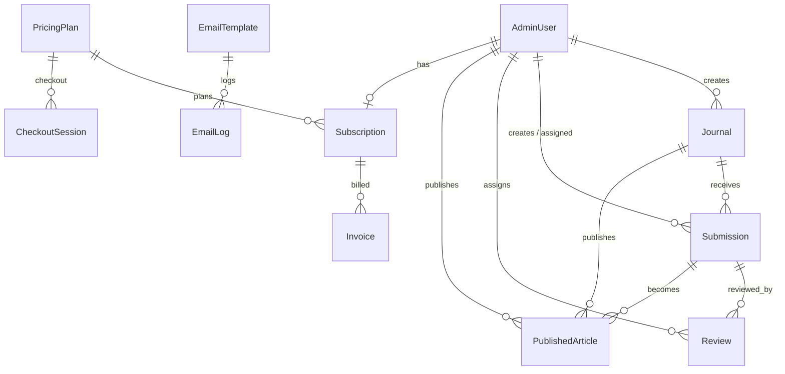
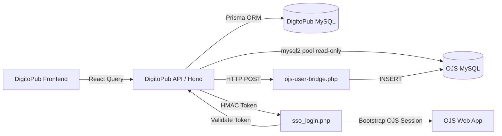

# DigitoPub — Comprehensive Engineering Analysis

> **Project**: DigitoPub Scientific Journals Platform
> **Repository**: `d:\scientific-journals-website`
> **Analyst**: Senior Full Stack Engineer Review
> **Date**: 2026-04-09

---

## 1. Project Overview

### Purpose & Core Idea

DigitoPub is a **scientific publishing storefront** — a read-heavy, public-facing Next.js application that showcases academic journals, articles, FAQs, and solutions. It is **not** the journal management system itself; that role belongs to an external **OJS (Open Journal Systems)** installation hosted at `submitmanager.com`.

The architectural philosophy is a **strict dual-boundary model**:

| Boundary | Domain | Responsibility |
|---|---|---|
| **digitopub.com** | Gateway / Storefront | Stateless, read-only public showcase. No user sessions. |
| **submitmanager.com** | OJS Identity Provider | Owns all users, roles, sessions, manuscript workflows. |

### Type Classification

**Hybrid Platform**: Public Web Portal + Admin Dashboard + OJS Integration Gateway + Billing SaaS (Stripe).

### Technology Stack

| Layer | Technology | Version |
|---|---|---|
| Framework | Next.js (App Router) | 16.0.10 |
| Language | TypeScript | 5.x |
| Runtime | Node.js / Bun | ≥18.18 |
| UI Library | React | 19.2.0 |
| Styling | TailwindCSS v4 + Radix UI primitives | 4.2.1 |
| State Management | Zustand | 5.0.11 |
| Server Framework | Hono (inside Next.js API routes) | 4.12.2 |
| Data Fetching | TanStack React Query | 5.90.21 |
| ORM | Prisma (MariaDB adapter) | 7.2.0 |
| Database | MySQL 8 / MariaDB | — |
| Auth (Admin) | JWT (jose) + bcryptjs | — |
| Validation | Zod v4 | 4.3.6 |
| Email | Nodemailer | 8.0.2 |
| Payments | Stripe | 20.4.1 |
| 3D Graphics | Spline / Three.js | — |
| Animation | GSAP + Framer Motion | — |
| Testing | Vitest | 4.0.18 |
| Deployment | Hostinger (PM2 / Node) | — |

---

## 2. Frontend Analysis

### 2.1 Architecture & Structure

The frontend follows a **feature-sliced architecture** inside `src/features/`, which is a strong organizational choice:

```
src/features/
├── journals/     (api/, components/, hooks/, schemas/, server/, stores/, types/)
├── ojs/          (api/, components/, constants/, hooks/, schemas/, server/, types/, utils/)
├── auth/         (api/, schemas/, server/, stores/, types/, utils/)
├── search/       (api/, schemas/, server/, store.ts)
├── billing/      ...
├── email-templates/ ...
├── faq/          ...
├── help/         ...
├── messages/     ...
├── metrics/      ...
├── reviews/      ...
├── solutions/    ...
├── statistics/   ...
└── about/        ...
```

**Verdict**: ✅ **Strong**. Each feature is self-contained with its own API hooks, schemas, server routes, types, and components. This is a mature, scalable pattern that enables independent feature development and clear ownership boundaries.

### 2.2 State Management

| Concern | Tool | Assessment |
|---|---|---|
| Server state | TanStack React Query | ✅ Excellent — proper cache/staleness management |
| Client UI state | Zustand stores (per-feature) | ✅ Good — lightweight, colocated with features |
| Theme | `next-themes` | ✅ Standard approach |
| Form state | `react-hook-form` + Zod resolvers | ✅ Excellent — validated at the form boundary |

> [!TIP]
> The separation of server state (React Query) from UI state (Zustand) is a best practice that many projects get wrong. DigitoPub gets this right.

### 2.3 API Integration Patterns

The frontend uses **Hono RPC client** for type-safe API calls:

```typescript
// src/lib/rpc.ts
export const client = hc<AppType>(`${baseUrl}/api`) as any
```

> [!WARNING]
> **Critical Issue**: The `as any` cast on the RPC client **completely destroys type-safety** at the API boundary. The comment references a known Hono issue with deep `.route()` nesting, but the workaround sacrifices the primary value of an RPC client. Every API call from the frontend is effectively untyped.

### 2.4 Performance Considerations

| Aspect | Implementation | Rating |
|---|---|---|
| 3D Globe (Spline/Three.js) | GPU paint containment, `contain: paint`, `overflow: hidden`, `isolate` | ✅ Well-managed |
| Image optimization | `images.unoptimized: true` in Next.js config | ❌ **All image optimization disabled** |
| Code splitting | Next.js App Router automatic + dynamic imports for OJS modules | ✅ Good |
| Skeleton loading | Custom skeleton components for stats and journal cards | ✅ Good UX |
| Search debounce | 300ms debounce on command palette input | ✅ Appropriate |
| Animation libraries | Both GSAP **and** Framer Motion loaded simultaneously | ⚠️ Bundle bloat — two animation libraries |

> [!CAUTION]
> **`images.unoptimized: true`** means Next.js serves raw, uncompressed images. On a content-heavy journals platform with cover images, this is a significant LCP and bandwidth penalty. This was likely set because Hostinger doesn't support the Sharp-based image optimizer, but a CDN or build-time optimization should be used instead.

### 2.5 Scalability Concerns

- **Homepage is `"use client"`**: The entire homepage (`app/page.tsx`) is a client component. This means zero SSR for the most SEO-critical page. For a scientific publishing platform, this is a significant SEO deficit — search engines need server-rendered content for journal listings, stats, and CTA sections.
- **No ISR/SSG**: None of the public pages use `generateStaticParams`, `revalidate`, or any form of static generation. Every page load hits the API fresh.

### 2.6 Anti-Patterns Detected

| Issue | Location | Severity |
|---|---|---|
| Entire homepage is CSR | `app/page.tsx` line 1: `"use client"` | 🔴 High |
| Dual animation libraries (GSAP + Framer Motion) | `package.json` | 🟡 Medium |
| RPC client cast to `any` | `src/lib/rpc.ts` line 19 | 🔴 High |
| No `<meta>` per-page SEO | Only root layout has metadata | 🟡 Medium |
| `images.unoptimized: true` | `next.config.mjs` line 4 | 🔴 High |
| No font loaded in layout | `app/layout.tsx` — `font-sans` class but no Google Font import | 🟡 Medium |

---

## 3. Backend Analysis

### 3.1 Server Architecture

The backend uses a **Hono-inside-Next.js** pattern:

```
Next.js App Router → app/api/[[...route]]/route.ts → Hono app → Feature routers
```

This is an increasingly popular approach that gives you:
- ✅ Type-safe route composition via Hono
- ✅ Middleware chain (CORS, logger, auth, cache headers)
- ✅ Deployable as a single Next.js app (no separate server)
- ⚠️ All API routes run in the serverless/edge model of Next.js, not a persistent Node.js server

### 3.2 API Design (REST)

All endpoints follow a consistent `{ success: boolean, data?: T, error?: string }` envelope:

```json
// Success
{ "success": true, "data": [...], "total": 10 }

// Error
{ "success": false, "error": "Journal not found" }
```

**Verdict**: ✅ Consistent envelope pattern. However, there is no versioning (`/api/v1/`) which will become a problem when breaking changes are needed.

### 3.3 Error Handling Strategy

```typescript
// Global error handler (src/server/app.ts)
app.onError((err, c) => {
    console.error(`[API Error]: ${err}`)
    return c.json({
        success: false,
        error: {
            message: "Internal server error",
            details: process.env.NODE_ENV === "development" ? err.message : undefined,
        },
    }, 500)
})
```

**Strengths**:
- ✅ Environment-aware error detail suppression
- ✅ Consistent JSON error responses
- ✅ Per-route try/catch blocks

**Weaknesses**:
- ❌ No error classification (operational vs programmer errors)
- ❌ No structured error codes (just string messages)
- ❌ `console.error` only — no structured logging (no correlation IDs, no log levels)
- ❌ No error reporting integration (Sentry, etc.)

### 3.4 Authentication & Authorization

The admin auth system uses **JWT stored in httpOnly cookies** (7-day expiry):

```
Login → bcrypt verify → jose.SignJWT → httpOnly cookie → Middleware verifies on /admin/*
```

| Aspect | Implementation | Assessment |
|---|---|---|
| Password hashing | bcryptjs (10 rounds) | ✅ Standard |
| Token signing | HS256 via jose | ✅ Good |
| Cookie security | httpOnly, secure (prod), sameSite: lax | ✅ Good |
| Middleware guard | JWT verification on all `/admin/*` routes | ✅ Good |
| Role-based access | `requireAdmin`, `requireRole(...)` middleware | ✅ Good |
| Token refresh | ❌ None | ⚠️ 7-day hard expiry, no rotation |
| CSRF protection | ❌ None (sameSite:lax only) | ⚠️ Partial protection |

> [!WARNING]
> **Default JWT secret in development**: `getJwtSecret()` falls back to `"default-development-secret-change-me"` when `JWT_SECRET` is missing. If this ever leaks to production (e.g., misconfigured env), it's a full auth compromise.

### 3.5 Performance & Scalability

- **Connection pooling**: Prisma with MariaDB adapter, `connectionLimit: 10` ✅
- **OJS pool**: Separate `mysql2` pool, `connectionLimit: 3` ✅ (conservative, appropriate for read-only)
- **Rate limiting**: In-memory IP-based limiter for registration endpoint ✅
- **Caching**: In-memory object cache for OJS journals with TTL ✅
- **No-cache headers**: All API responses set `Cache-Control: no-store` ⚠️ (even for public journal data that could be cached)

> [!IMPORTANT]
> The in-memory rate limiter and OJS cache **will not work** in a horizontally scaled deployment (multiple instances). They are appropriate for the current single-instance Hostinger deployment, but this is a scaling ceiling.

---

## 4. API Layer Evaluation

### 4.1 Endpoint Design Quality

| Route | Method | Auth | Validation | Assessment |
|---|---|---|---|---|
| `/api/journals` | GET | Public | Pagination params | ✅ Good |
| `/api/journals/:id` | GET | Public | Zod slug param | ✅ Multi-strategy lookup (path → ojs_id → BigInt) |
| `/api/journals` | POST | Admin | Zod body | ✅ Good |
| `/api/journals/:id` | PATCH | Admin | Zod param + body | ✅ Good |
| `/api/journals/:id` | DELETE | Admin | Zod param | ✅ Good |
| `/api/ojs/journals` | GET | Public | — | ✅ With Zod response validation |
| `/api/ojs/sync` | GET | Bearer CRON_SECRET | — | ✅ Machine-to-machine auth |
| `/api/ojs/register` | POST | Public + Rate Limit | Zod body | ✅ Good |
| `/api/ojs/sso/validate` | GET | Public | Query param | ⚠️ No rate limit on validation endpoint |
| `/api/search` | GET | Public | Zod query | ✅ Good |
| `/api/auth/login` | POST | Public | Zod body | ✅ Expected |

### 4.2 Code Organization

Each feature's server route is a self-contained Hono router exported and mounted in `src/server/app.ts`. This is clean and maintainable.

**However**, there is significant **code duplication** in the journal lookup logic. The pattern below is repeated verbatim in **5+ routes**:

```typescript
let journal = await prisma.journal.findUnique({ where: { ojs_path: id }, ... })
if (!journal) journal = await prisma.journal.findUnique({ where: { ojs_id: id }, ... })
if (!journal && /^\d+$/.test(id)) journal = await prisma.journal.findUnique({ where: { id: BigInt(id) }, ... })
```

This should be extracted into a shared `resolveJournal(id)` utility.

### 4.3 Data Validation

- ✅ **Zod schemas** for all input validation (params, body, query)
- ✅ **Zod response validation** on OJS journal data (`ojsJournalsResponseSchema.safeParse`)
- ⚠️ **No output validation** on most Prisma responses — relies on Prisma's type system

### 4.4 Error Handling Consistency

Most routes follow a consistent `try/catch → console.error → { success: false, error: "..." }` pattern. This is consistent but lacks:
- Structured error codes
- Request correlation IDs
- Distinguishing between 400 (client) and 500 (server) error causes beyond ad-hoc checks

---

## 5. Database Analysis

### 5.1 Database Type

**MySQL 8 / MariaDB** via Prisma ORM with the `@prisma/adapter-mariadb` driver adapter.

Two separate databases are in use:
1. **DigitoPub DB** (Prisma-managed) — primary application data
2. **OJS DB** (read-only `mysql2` pool) — external OJS 3.x installation

### 5.2 Schema Design & Relationships

The Prisma schema defines **15 models** with clear relationships:



**Strengths**:
- ✅ Proper use of `BigInt` auto-increment PKs (consistent with MySQL best practices)
- ✅ Proper `onDelete` cascade/setNull behaviors
- ✅ JSON fields for flexible data (co_authors, keywords, features)
- ✅ OJS link fields (`ojs_id`, `ojs_path`, `ojs_submission_id`, `ojs_publication_id`) as unique identifiers

**Weaknesses**:
- ❌ `VerificationCode.user_id` is a `BigInt` but has **no foreign key** to `AdminUser` — orphan risk
- ❌ No composite indexes (e.g., `[journal_id, status]` on submissions)
- ❌ `Message` model has no relation to any user — anonymous contact form data with no traceability

### 5.3 Indexing Strategy

Current indexes:

| Table | Indexed Columns |
|---|---|
| `admin_users` | `email` |
| `journals` | `field`, `status`, `issn`, `ojs_id` |
| `submissions` | `journal_id`, `status`, `author_email`, `submission_date`, `ojs_submission_id` |
| `reviews` | `submission_id`, `review_status`, `reviewer_email` |
| `published_articles` | `journal_id`, `doi`, `publication_date`, `ojs_publication_id` |
| `email_logs` | `template_id`, `status`, `to_email` |

**Missing indexes**:
- `journals.created_at` — used in `ORDER BY` for the main listing
- `submissions.[journal_id, status]` composite — most admin queries filter by both
- `published_articles.[journal_id, publication_date]` composite — archive queries

### 5.4 Potential Bottlenecks

1. **Runtime schema migrations** (`src/lib/db/init.ts`): Raw `ALTER TABLE` and `CREATE TABLE IF NOT EXISTS` statements run on app startup. This is a fragile deployment pattern — concurrent cold starts could race on migrations.

2. **OJS query complexity**: The `fetchFromDatabase()` query joins `journals` against **13 LEFT JOINs** on `journal_settings`. This is inherent to OJS's EAV (Entity-Attribute-Value) schema design, but it can be slow on large OJS installations.

3. **No pagination on OJS sync**: `syncOjsJournals` fetches ALL journals from OJS in one query, then batches Prisma writes. For large OJS installations (100+ journals), this could cause memory pressure.

---

## 6. System Integration

### 6.1 Frontend ↔ Backend Communication

```
React Component → useQuery hook → Hono RPC client → /api/[[...route]] → Hono router → Prisma/OJS
```

- ✅ **Consistent data fetching**: All API calls go through React Query hooks, which handle caching, deduplication, and background refetching.
- ✅ **Serialization layer**: `serializeRecord` / `serializeMany` handles BigInt → string conversion for JSON compatibility.

### 6.2 Data Fetching Strategy

| Strategy | Used For | Assessment |
|---|---|---|
| Client-side (React Query) | All public and admin pages | ⚠️ Over-used — public pages should use SSR/ISR |
| Server-rendered | None currently | ❌ Missing |
| Dynamic imports | OJS modules (loaded only when OJS is configured) | ✅ Smart |
| Fire-and-forget | OJS startup sync, email dispatch | ✅ Non-blocking |

### 6.3 Caching Mechanisms

| Cache | Type | TTL | Scope |
|---|---|---|---|
| OJS journals | In-memory object | Configurable (via `CACHE_TTL`) | Single process |
| React Query client | Browser memory | Default stale time | Per-user browser |
| Static pages (search) | In-memory array | Permanent (app lifetime) | Single process |
| API responses | `Cache-Control: no-store` | None | ❌ Not cached by CDN |

> [!IMPORTANT]
> Public journal data is fetched fresh from the database on **every request**. For a read-heavy storefront, this is wasteful. ISR with `revalidate: 3600` (1 hour) would dramatically reduce database load.

---

## 7. OJS (Open Journal Systems) Integration

### 7.1 Integration Method

**Dual-mode integration**:

1. **Direct Database Read** (primary): A read-only `mysql2` connection pool queries the OJS MySQL database directly. This is used for journal metadata, submissions, publications, issues, and articles.

2. **HTTP Bridge** (provisioning): User registration is proxied to `ojs-user-bridge.php` on the OJS server via an authenticated POST request.

3. **Stateless HMAC SSO** (handover): After registration, a 5-minute HMAC token is generated and the user is redirected to `sso_login.php` on OJS, which validates the token back against DigitoPub's API.

### 7.2 Integration Architecture



### 7.3 Strengths

- ✅ **Read-only OJS access**: No writes to the OJS database, preventing data corruption
- ✅ **Retry logic**: Exponential backoff on OJS queries (3 attempts, 1s → 2s → 4s)
- ✅ **Non-retryable error detection**: Access denied, bad DB, host blocked errors abort immediately
- ✅ **Graceful degradation**: If OJS is not configured, endpoints return empty data instead of errors
- ✅ **HMAC SSO with timing-safe comparison**: Uses `crypto.timingSafeEqual` to prevent timing attacks
- ✅ **HTTPS enforcement**: Non-loopback OJS URLs must use HTTPS

### 7.4 Weak Points & Risks

| Risk | Severity | Description |
|---|---|---|
| **OJS schema coupling** | 🔴 High | Direct SQL against OJS tables (`journals`, `journal_settings`, `submissions`, `issues`) creates tight coupling to OJS 3.x schema. An OJS upgrade (e.g., to OJS 4.x) could silently break queries. |
| **No schema validation on OJS reads** | 🟡 Medium | `ojsQuery<T>` uses a generic type parameter but performs no runtime validation on the returned rows. Malformed OJS data could propagate silently. |
| **SSL `rejectUnauthorized: false`** | 🔴 High | The OJS database connection disables certificate verification. This allows MITM attacks on the database connection between DigitoPub and OJS. |
| **SSO validation endpoint is unauthenticated** | 🟡 Medium | `GET /api/ojs/sso/validate` can be called by anyone with a token. While the HMAC prevents forgery, there's no rate limit to prevent brute-force attempts. |
| **No connection health monitoring** | 🟡 Medium | The OJS pool has no periodic health check. A stale connection pool could serve errors until the pool times out. |

### 7.5 Suggested Improvements

1. **Abstract OJS queries behind a versioned adapter**: Create an `OjsAdapter` interface with methods like `getJournals()`, `getIssues()`, etc. When OJS upgrades, only the adapter needs updating.
2. **Add Zod validation on OJS query results**: Validate each row from `ojsQuery` against a schema before mapping.
3. **Enable SSL certificate verification**: Use a proper CA certificate for the OJS database connection.
4. **Add rate limiting to SSO validate endpoint**: Prevent brute-force token guessing.
5. **Connection pool health checks**: Implement periodic `SELECT 1` pings or use the pool's built-in keep-alive more aggressively.

---

## 8. Code Quality Review

### 8.1 Readability & Maintainability

| Aspect | Rating | Notes |
|---|---|---|
| Naming conventions | ✅ Good | `snake_case` for DB fields, `camelCase` for JS, consistent throughout |
| Comments & docs | ✅ Good | JSDoc on key functions, section separators (`// ─── Section ───`) in routes |
| File organization | ✅ Excellent | Feature-sliced architecture is clean and discoverable |
| TypeScript usage | ⚠️ Mixed | Strong in schemas/types, but `as any` casts in critical paths (RPC, OJS pool config) |

### 8.2 Structure & Modularity

- ✅ **Barrel exports** (`index.ts`) in each feature — clean public API
- ✅ **Schema-first design** — Zod schemas define the contract, types are inferred
- ✅ **Separation of concerns** — server routes, API hooks, components, and stores are separated
- ⚠️ **Shared utilities are thin** — `src/lib/` has only 8 files. Business logic lives in feature folders, which is good, but cross-cutting concerns (logging, error handling, monitoring) are missing.

### 8.3 Reusability

- ✅ `serializeRecord` / `serializeMany` — reusable BigInt serialization
- ✅ `parsePagination` / `paginatedResponse` — reusable pagination helpers
- ✅ `checkRateLimit` — configurable, reusable rate limiter
- ❌ Journal lookup logic is duplicated across 5+ routes (should be `resolveJournal()`)
- ❌ OJS configuration check (`isOjsConfigured()` + graceful fallback) is duplicated in every route

### 8.4 SOLID Principles

| Principle | Adherence | Notes |
|---|---|---|
| **S** (Single Responsibility) | ✅ Good | Feature modules are focused; email service is separate from email events |
| **O** (Open/Closed) | ⚠️ Partial | No plugin/extension points. Adding a new content type requires modifying the search route directly. |
| **L** (Liskov Substitution) | ✅ N/A | No class hierarchies to evaluate |
| **I** (Interface Segregation) | ⚠️ Partial | `AdminUser` model serves as both admin and "author" in search, blurring roles |
| **D** (Dependency Inversion) | ❌ Poor | All routes directly import `prisma` and `ojsQuery`. No DI container, no abstraction layer. Testing requires full database. |

---

## 9. Issue Detection

### 9.1 Potential Bugs

| # | Issue | Location | Impact |
|---|---|---|---|
| 1 | **`JWT_SECRET` evaluated at module load** (`const JWT_SECRET = getJwtSecret()` at line 25 of `auth-edge.ts`) | `src/lib/db/auth-edge.ts` | If env vars load after module initialization (e.g., in some serverless environments), all JWTs will be signed with the fallback secret. |
| 2 | **Race condition in DB init** | `src/lib/db/init.ts` | Multiple concurrent cold starts can race on `ALTER TABLE` statements. While `IF NOT EXISTS` and `Duplicate column name` catches mitigate this, it's fragile. |
| 3 | **`searchRouter` uses `contains` without case-insensitive flag** | `src/features/search/server/route.ts` | MySQL `contains` is case-insensitive by default with `utf8mb4_unicode_ci`, but this is implicit and database-collation-dependent. |
| 4 | **Debug endpoint in production** | `journals/server/route.ts` line 42: `/debug-covers` | Protected by `requireAdmin` but still deployed to production. Should be behind a feature flag or removed. |
| 5 | **`contact_email` setting has a typo** | `src/lib/db/init.ts` line 198: `'support@digstobob.com'` | Likely should be a real domain — this seeds an incorrect contact email. |

### 9.2 Performance Issues

| # | Issue | Location | Impact |
|---|---|---|---|
| 1 | **Homepage is 100% CSR** | `app/page.tsx` | TTFB and FCP are degraded; no SSR-rendered content for bots |
| 2 | **Images unoptimized** | `next.config.mjs` | All images served at original size/format |
| 3 | **OJS 13-JOIN query on every uncached request** | `ojs-service.ts` | Can be slow on large OJS installations |
| 4 | **Search fires 7+ parallel DB queries** | `search/server/route.ts` | Each search term triggers up to 7 `Promise.all` branches including indirect journal lookup via articles |
| 5 | **No API response caching for public data** | `src/server/app.ts` line 70 | `Cache-Control: no-store` on all responses, even public journal listings |
| 6 | **Two animation libraries** | `package.json` | GSAP (67KB) + Framer Motion (115KB) = ~180KB of animation code |

### 9.3 Security Vulnerabilities

| # | Vulnerability | Severity | Location |
|---|---|---|---|
| 1 | **`rejectUnauthorized: false`** on OJS DB SSL | 🔴 High | `ojs-client.ts` line 37 |
| 2 | **Default JWT secret fallback** | 🔴 High | `auth-edge.ts` line 20 |
| 3 | **No CSRF tokens** for admin mutations | 🟡 Medium | All POST/PATCH/DELETE admin routes |
| 4 | **SSO validate endpoint unrate-limited** | 🟡 Medium | `sso-route.ts` |
| 5 | **`$executeRawUnsafe` with string interpolation** | 🟡 Medium | `db/init.ts` line 131: column names from array, though values are hardcoded |
| 6 | **No Content-Security-Policy headers** | 🟡 Medium | `middleware.ts` / `next.config.mjs` |
| 7 | **Admin email enumeration** | 🟡 Low | Login likely returns different errors for "user not found" vs "wrong password" |
| 8 | **No JWT token revocation** | 🟡 Low | Logout deletes cookie but token remains valid for 7 days |

### 9.4 Code Smells

| Smell | Location | Recommendation |
|---|---|---|
| `as any` on RPC client | `src/lib/rpc.ts` | Pin Hono version that fixes type inference or flatten router |
| Journal lookup duplicated 5× | `journals/server/route.ts` | Extract `resolveJournal(id, select)` utility |
| `console.log` as logging | Throughout | Use structured logger (pino, winston) |
| Inline SQL for migrations | `db/init.ts` | Use Prisma migrations properly or a dedicated migration runner |
| `_server.js.bak` file in root | Project root | Remove backup files from source |
| `check-paths.ts`, `check_env.ts` in root | Project root | Move to `scripts/` |

---

## 10. Recommendations

### 10.1 Architectural Improvements

| Priority | Recommendation | Effort | Impact |
|---|---|---|---|
| 🔴 P0 | **Convert homepage to SSR** — Remove `"use client"` from `app/page.tsx`, fetch journals via server components, pass to client sub-components | Medium | SEO, TTFB, FCP |
| 🔴 P0 | **Implement ISR for public pages** — `export const revalidate = 3600` on journal listings and detail pages | Low | DB load reduction, response speed |
| 🟡 P1 | **Extract `resolveJournal()` utility** — DRY the 3-strategy journal lookup | Low | Maintenance |
| 🟡 P1 | **Create an OJS adapter interface** — Abstract OJS queries behind a versioned adapter for upgrade resilience | Medium | Maintainability |
| 🟡 P1 | **Introduce structured logging** — Replace `console.log/error` with pino + correlation IDs | Medium | Observability |
| 🟢 P2 | **Add API versioning** (`/api/v1/`) | Low | Future-proofing |
| 🟢 P2 | **Remove duplicate animation library** — Choose either GSAP or Framer Motion | Medium | Bundle size |

### 10.2 Performance Optimizations

| Priority | Recommendation | Expected Impact |
|---|---|---|
| 🔴 P0 | **Enable Next.js Image Optimization** or use a CDN with on-the-fly resizing | 40-60% bandwidth reduction |
| 🔴 P0 | **Add `Cache-Control` headers for public GET endpoints** (journals, search, static data) — e.g., `max-age=300, stale-while-revalidate=600` | Reduce DB queries by 80%+ |
| 🟡 P1 | **Add Redis caching** for OJS data and search results | Horizontal scalability |
| 🟡 P1 | **Add composite indexes** to submissions and published_articles | Query performance |
| 🟢 P2 | **Lazy-load 3D globe** — use `next/dynamic` with `ssr: false` and an intersection observer | Initial bundle size |

### 10.3 Security Enhancements

| Priority | Recommendation |
|---|---|
| 🔴 P0 | **Remove default JWT secret fallback** — fail hard if `JWT_SECRET` is missing in production |
| 🔴 P0 | **Enable SSL certificate verification** on OJS database connection |
| 🟡 P1 | **Add Content-Security-Policy headers** in middleware |
| 🟡 P1 | **Implement JWT refresh tokens** with shorter access token lifetime (15 min) |
| 🟡 P1 | **Add rate limiting to SSO validation endpoint** |
| 🟢 P2 | **Add CSRF tokens** for admin state-changing operations |
| 🟢 P2 | **Implement token revocation** via a deny-list or short-lived tokens |

### 10.4 Refactoring Suggestions

1. **Fix RPC type-safety**: Either flatten the Hono router to eliminate the `as any` cast, or create typed API wrappers manually.
2. **Migrate runtime SQL migrations to Prisma Migrate**: The current `ALTER TABLE` approach in `init.ts` is fragile. Use `prisma migrate deploy` in the build script (which is already partially implemented).
3. **Separate admin API from public API**: The admin panel could use its own Hono app with stricter middleware, improving security posture.
4. **Introduce error boundary components**: The current `global-error.tsx` is minimal. Add per-route error boundaries for better UX.
5. **Clean up root directory**: Move `check-paths.ts`, `check_env.ts`, `verify-db.ts`, `_server.js.bak` out of the project root.

---

## 11. Final Evaluation

### Overall Rating: **6.5 / 10**

### Strengths

| # | Strength |
|---|---|
| 1 | **Feature-sliced architecture** — Clean, disciplined module boundaries with barrel exports. This is production-grade organization. |
| 2 | **OJS integration design** — The dual-boundary model (stateless gateway + IDP) is architecturally sound and well-documented. |
| 3 | **Schema-first validation** — Zod schemas at every API boundary with proper Hono middleware integration. |
| 4 | **Security consciousness** — HMAC tokens with timing-safe comparison, HTTPS enforcement, read-only OJS access, rate limiting on registration. |
| 5 | **Resilience patterns** — Retry with exponential backoff, non-retryable error detection, graceful OJS degradation, fire-and-forget startup sync. |
| 6 | **Modern stack choices** — Hono for type-safe server, React Query for data fetching, Zustand for client state — all current best practices. |

### Weaknesses

| # | Weakness |
|---|---|
| 1 | **No SSR/ISR on public pages** — The most critical SEO and performance gap. A scientific publishing platform needs server-rendered content. |
| 2 | **RPC type-safety is broken** — The `as any` cast on the Hono client means the frontend-backend contract is unverified. |
| 3 | **Security gaps** — Default JWT secret fallback, disabled SSL verification, no CSP headers, no CSRF protection. |
| 4 | **No structured logging or monitoring** — `console.log` throughout. No correlation IDs, no alerting, no APM. |
| 5 | **Runtime schema migrations** — SQL `ALTER TABLE` on startup is fragile and race-prone. |
| 6 | **All images unoptimized** — Significant performance penalty for a content-heavy platform. |
| 7 | **Tight OJS schema coupling** — Direct SQL against OJS tables without an abstraction layer. |

### Verdict

DigitoPub demonstrates **strong architectural thinking** in its feature-sliced design, OJS integration boundaries, and validation patterns. The codebase is well-organized and shows clear engineering intent. However, it has **critical production readiness gaps** in SSR/SEO, security hardening, observability, and image optimization that would need to be addressed before it could be considered a mature, production-grade platform. The OJS integration, while functional, is tightly coupled and would benefit from an abstraction layer for maintainability.

**The path to production-ready (8+/10) requires**: SSR for public pages, fixing the RPC type-safety, security hardening (JWT secret, SSL, CSP), structured logging, and image optimization. These are all achievable within 2-3 sprints of focused work.
