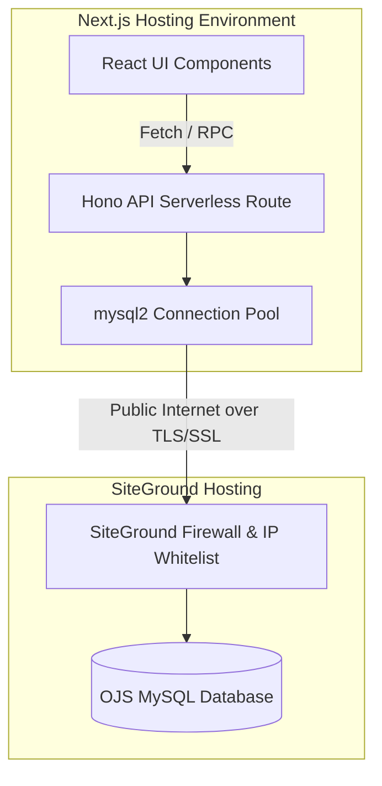

# DigitoPub / Submit Manager — OJS Database Integration
## Technical Architecture Report

> **Date:** 2026-03-06  
> **Database Instance:** `dbkgvcunttgs97` on SiteGround (`gparm12.siteground.biz`)  
> **Current Branch:** `ui/refactor-design-system`  
> **Stack:** Next.js 16 · Hono · Zod · TanStack React Query · Prisma · MariaDB

---

## 1. Connection Testing Plan

The project already has three diagnostic scripts. Below is the **definitive step-by-step validation sequence** using existing and new tooling.

### Step 1 — Environment Verification

Verify [.env](file:///home/glitch/Documents/Next.JS/scientific-journals-website/.env) contains all OJS variables **un-commented**:

```env
OJS_DATABASE_HOST="gparm12.siteground.biz"
OJS_DATABASE_PORT="3306"
OJS_DATABASE_NAME="dbkgvcunttgs97"
OJS_DATABASE_USER="ua9oxq3q2pzvz"
OJS_DATABASE_PASSWORD="<password>"
```

**Existing script:** Run `bun run scripts/diagnose-ojs-connection.ts` — Step 1 of this script validates that all required `OJS_DATABASE_*` vars are present and prints masked values.

### Step 2 — Network Verification

| Test | Command | Expected |
|------|---------|----------|
| DNS resolution | `dig +short gparm12.siteground.biz` | Returns one or more IPv4 addresses |
| ICMP ping | `ping -c 3 gparm12.siteground.biz` | Replies received (may be blocked — not a blocker) |
| TCP port probe | `nc -zv gparm12.siteground.biz 3306 -w 10` | `Connection succeeded` or `open` |

**Existing script:** [diagnose-ojs-connection.ts](file:///home/glitch/Documents/Next.JS/scientific-journals-website/scripts/diagnose-ojs-connection.ts) Steps 2 and 3 perform DNS resolution (`dns.resolve4`) and TCP socket check (`net.Socket.connect`) with timeout handling.

> [!IMPORTANT]
> SiteGround has confirmed that remote MySQL is enabled and the IP has been whitelisted. If `nc` fails, ask SiteGround to re-flush the MySQL host cache again and verify the whitelisted IP matches your server's **outbound** IP (not inbound).

### Step 3 — Application-Level MySQL Test

```bash
# Quick connection test using the existing script
bun run scripts/diagnose-ojs-connection.ts
```

This script already handles:
- MySQL authentication with `allowPublicKeyRetrieval: true`
- SSL/TLS errors (suggests `ssl: { rejectUnauthorized: false }`)
- Access denied diagnostics (extracts and displays the rejected IP)
- Detailed error code switching (1045, 1044, 1049, 1129)

**Alternative — raw mysql CLI:**

```bash
mysql -h gparm12.siteground.biz -P 3306 -u ua9oxq3q2pzvz -p dbkgvcunttgs97 \
  -e "SELECT VERSION(); SHOW TABLES;"
```

### Step 4 — Minimal SQL Validation

After authentication succeeds (Step 4 of [diagnose-ojs-connection.ts](file:///home/glitch/Documents/Next.JS/scientific-journals-website/scripts/diagnose-ojs-connection.ts)), the script's Step 5 performs:

1. `SHOW TABLES` — confirms SELECT privilege and lists all OJS tables
2. `SELECT COUNT(*) FROM journals` — confirms the `journals` table exists
3. The full application query (journals + journal_settings JOIN) — confirms the exact SQL the feature layer will run

**Expected output:**

```
✅ SELECT privilege: OK (47 tables found)
✅ OJS 'journals' table: EXISTS (5 rows)
✅ Application query: OK (3 active journals)
```

### Step 5 — Logging & Error Inspection

If any step fails, the script outputs:
- Exact error code and SQL state
- Human-readable fix instructions (SiteGround panel steps)
- IP extraction from access-denied messages

**Proof of success:** All 5 steps pass → the application's `GET /api/ojs/journals` endpoint will work.

---

## 2. Decision Matrix

| Criterion | Direct MySQL | PHP Proxy API |
|-----------|:---:|:---:|
| **Latency** | ✅ ~50–150 ms (single TCP hop) | ❌ ~300–800 ms (HTTP → PHP → MySQL → PHP → HTTP) |
| **Security** | ⚠️ Requires IP whitelisting + SSL; credentials in env | ✅ API key auth; DB credentials stay on SiteGround |
| **Coupling** | ⚠️ App depends on OJS schema directly | ✅ PHP proxy abstracts schema |
| **Maintainability** | ✅ Single codebase (TypeScript only) | ❌ Two codebases (TS + PHP); separate deployments |
| **Type Safety** | ✅ Full Zod + TypeScript control | ❌ Loose JSON contract; no compile-time checking |
| **Scalability** | ✅ Connection pooling via MariaDB driver | ⚠️ Limited by PHP process model on shared hosting |
| **Failure modes** | ✅ Retry logic in [ojs-client.ts](file:///home/glitch/Documents/Next.JS/scientific-journals-website/src/features/ojs/server/ojs-client.ts) with backoff | ❌ Single HTTP call; PHP errors are opaque |
| **Data Validation** | ✅ Zod safeParse on every query result | ❌ Must trust PHP output |
| **Deployment** | ✅ Single deployment pipeline | ❌ PHP must be deployed separately to SiteGround |
| **Monitoring** | ✅ Health endpoint + pool stats | ⚠️ Requires separate PHP health checks |

### Recommendation

> [!TIP]
> **Use Option A — Direct MySQL Connection** as the primary mode.
>
> Keep the PHP proxy as a **fallback** (the current dual-mode architecture in [route.ts](file:///home/glitch/Documents/Next.JS/scientific-journals-website/src/features/ojs/server/route.ts) already supports this via [getOjsMode()](file:///home/glitch/Documents/Next.JS/scientific-journals-website/src/features/ojs/server/route.ts#7-22)).

**Rationale:**
1. SiteGround has confirmed remote MySQL access is enabled — the historical blocker is removed.
2. The existing [ojs-client.ts](file:///home/glitch/Documents/Next.JS/scientific-journals-website/src/features/ojs/server/ojs-client.ts) already implements connection pooling with retry/backoff.
3. Direct access eliminates the PHP codebase entirely from the critical path, reducing total attack surface and maintenance burden.
4. Full Zod validation across the entire pipeline is only possible with direct access.

**Risk mitigation:** If direct MySQL fails (e.g. SiteGround reverts the change), the `OJS_API_URL` env var can be set to instantly switch to the HTTP proxy — no code change needed.

---

## 3. Recommended Architecture

### Data Flow

```mermaid
graph LR
    A["OJS MySQL<br/>dbkgvcunttgs97"] -->|MariaDB driver| B["ojs-client.ts<br/>Connection Pool"]
    B -->|Raw rows| C["Zod Mapper<br/>DB → Domain"]
    C -->|Validated domain model| D["Hono Route<br/>server/route.ts"]
    D -->|JSON response| E["Hono RPC Client<br/>hc&lt;AppType&gt;"]
    E -->|Typed response| F["TanStack Query Hook<br/>useGetOjsJournals"]
    F -->|Reactive data| G["React UI Component"]
```



### Backend Layer

```
src/features/ojs/
├── api/                          # Frontend hooks (client-side)
│   └── use-get-ojs-journals.ts   # TanStack Query hook
├── schemas/
│   └── ojs-schema.ts             # Zod schemas + response schema
├── server/
│   ├── ojs-client.ts             # MariaDB pool + ojsQuery + health check
│   ├── ojs-mappers.ts            # [NEW] Zod mappers: raw DB row → domain model
│   └── route.ts                  # Hono routes (GET /journals, /stats, /health)
├── types/
│   └── ojs-type.ts               # TypeScript interfaces
├── constants/                    # [NEW] (optional: query constants, cache TTLs)
├── index.ts                      # Public barrel exports
└── server.ts                     # Re-export for server/app.ts
```

### Frontend Layer

```
src/features/ojs/
├── api/
│   └── use-get-ojs-journals.ts   # useQuery with typed RPC call
├── components/                   # [NEW] OJS-specific UI components
│   ├── ojs-journal-card.tsx
│   └── ojs-journals-list.tsx
└── hooks/                        # [NEW] Custom hooks (filters, sorting)
    └── use-ojs-journal-filter.ts
```

### Key Architecture Decisions

1. **[ojs-client.ts](file:///home/glitch/Documents/Next.JS/scientific-journals-website/src/features/ojs/server/ojs-client.ts) is the only file that imports `mariadb`** — isolating the driver from the rest of the app.
2. **Zod mappers** transform raw DB rows (snake_case, integer booleans) into clean domain models (camelCase, native booleans).
3. **[route.ts](file:///home/glitch/Documents/Next.JS/scientific-journals-website/src/features/ojs/server/route.ts) calls mappers, then validates** the full response with `safeParse` before returning.
4. **The RPC client** ([src/lib/rpc.ts](file:///home/glitch/Documents/Next.JS/scientific-journals-website/src/lib/rpc.ts)) provides typed access — no manual [fetch](file:///home/glitch/Documents/Next.JS/scientific-journals-website/src/features/ojs/server/route.ts#85-126) URLs.
5. **TanStack Query hooks** manage caching (5-minute stale time), deduplication, and background refetch.

---

## 4. Feature Structure Implementation: `ojs-journals`

> [!NOTE]
> The project already has `src/features/ojs/` which covers this. Below is the ideal structure with the existing files annotated and new files marked `[NEW]`.

### Directory Responsibilities

| Folder | Responsibility | Current State |
|--------|---------------|---------------|
| `api/` | Frontend React Query hooks for data fetching | ✅ `use-get-ojs-journals.ts` exists |
| `components/` | OJS-specific React components (cards, lists, filters) | ❌ **Missing** — components are scattered in `app/` pages |
| `server/` | Hono route handlers + DB client + mappers | ✅ `route.ts`, `ojs-client.ts` exist; `ojs-mappers.ts` **[NEW]** |
| `hooks/` | Non-data custom hooks (UI state, filters, sorting) | ❌ **Missing** |
| `schemas/` | Zod schemas for validation at all layers | ✅ `ojs-schema.ts` exists |
| `types/` | TypeScript interfaces exported for consumers | ✅ `ojs-type.ts` exists |
| `constants/` | Feature-scoped constants (query keys, cache TTLs, SQL) | ❌ **Missing** |

### Example: New `ojs-mappers.ts`

```typescript
// src/features/ojs/server/ojs-mappers.ts
import { z } from "zod"
import { ojsJournalSchema } from "../schemas/ojs-schema"

/** Raw row shape from the OJS MySQL database */
const ojsJournalRowSchema = z.object({
    journal_id: z.number(),
    path: z.string(),
    primary_locale: z.string(),
    enabled: z.number(),           // DB stores as 0/1
    name: z.string().nullable(),
    description: z.string().nullable(),
})

export type OjsJournalRow = z.infer<typeof ojsJournalRowSchema>

/** Maps a raw DB row to the application domain model */
export function mapOjsJournalRow(row: OjsJournalRow) {
    return ojsJournalSchema.parse({
        journal_id: row.journal_id,
        path: row.path,
        primary_locale: row.primary_locale,
        enabled: row.enabled === 1,   // int → boolean
        name: row.name,
        description: row.description,
    })
}
```

---

## 5. Global API Routing Design

### Current Setup

The existing [route.ts](file:///home/glitch/Documents/Next.JS/scientific-journals-website/app/api/%5B%5B...route%5D%5D/route.ts) is already correctly wired:

```typescript
// app/api/[[...route]]/route.ts
import { handle } from "hono/vercel"
import { app } from "@/src/server/app"

export const GET = handle(app)
export const POST = handle(app)
export const PATCH = handle(app)
export const DELETE = handle(app)

export type { AppType } from "@/src/server/app"
```

### How Feature Routers Are Mounted

In [src/server/app.ts](file:///home/glitch/Documents/Next.JS/scientific-journals-website/src/server/app.ts):

```typescript
const apiApp = new Hono()
    .route("/journals", journalRouter)    // → /api/journals/*
    .route("/solutions", solutionRouter)  // → /api/solutions/*
    .route("/auth", authRouter)           // → /api/auth/*
    .route("/messages", messageRouter)    // → /api/messages/*
    .route("/ojs", ojsRouter)             // → /api/ojs/*
    .route("/home-stats", homeStatsRouter) // → /api/home-stats/*

const app = new Hono().basePath("/api")
app.route("/", apiApp)

export type AppType = typeof apiApp  // ← RPC type inference root
```

### Adding a New Feature Route

To add a new feature (e.g., `ojs-submissions`):

1. Create `src/features/ojs-submissions/server/route.ts` with a new `Hono()` instance
2. Add `import { ojsSubmissionsRouter } from "@/src/features/ojs-submissions/server"` to `app.ts`
3. Chain `.route("/ojs-submissions", ojsSubmissionsRouter)` onto `apiApp`
4. All HTTP methods (GET/POST/PATCH/DELETE) are automatically available because `route.ts` exports all four `handle(app)` bindings

> [!IMPORTANT]
> The `AppType` is derived from `typeof apiApp` — every `.route()` call is chained, so TypeScript infers all nested routes for the RPC client. **Always chain** (don't assign to intermediate variables).

---

## 6. RPC Client + Frontend Data Layer

### RPC Client

The existing [rpc.ts](file:///home/glitch/Documents/Next.JS/scientific-journals-website/src/lib/rpc.ts) provides the typed client:

```typescript
import { hc } from "hono/client"
import type { AppType } from "../server/app"

const baseUrl = typeof window !== "undefined"
    ? window.location.origin
    : (process.env.NEXT_PUBLIC_APP_URL || "http://localhost:3000")

export const client = hc<AppType>(`${baseUrl}/api`) as any
```

> [!WARNING]
> The `as any` cast is a known workaround for Hono v4.12.2 type inference issues with deeply nested `.route()` chains. This should be revisited when upgrading Hono. It means **the developer must verify route paths manually** until this is resolved.

### How the RPC Client Works

```typescript
// Type-safe call (mirrors /api/ojs/journals)
const response = await client.ojs.journals.$get()
const data = await response.json()
// 'data' is typed as OjsJournalsResponse
```

### TanStack React Query Integration

The existing hook in [use-get-ojs-journals.ts](file:///home/glitch/Documents/Next.JS/scientific-journals-website/src/features/ojs/api/use-get-ojs-journals.ts):

```typescript
export function useGetOjsJournals() {
    return useQuery<OjsJournalsResponse>({
        queryKey: ["ojs-journals"],
        queryFn: async () => {
            const response = await client.ojs.journals.$get()
            const data = await response.json()
            if (!response.ok) {
                throw new Error((data as any).error || "Failed to fetch OJS journals")
            }
            return data
        },
        staleTime: 5 * 60 * 1000, // 5 minutes
    })
}
```

### Data Flow Roles

| Layer | Role | Location |
|-------|------|----------|
| **React Query hook** | Manages cache, deduplication, background refetch, loading/error states | `src/features/ojs/api/` |
| **RPC client** | Type-safe HTTP call; no manual URL construction | `src/lib/rpc.ts` |
| **Caching** | `staleTime` = 5 min (OJS data is semi-static); `gcTime` defaults to 5 min | Hook options |
| **Request lifecycle** | `idle → loading → success/error → stale → refetch` managed by React Query | Automatic |

### Pattern for Mutation Hooks

For future write operations (POST/PATCH/DELETE), follow this pattern:

```typescript
export function useUpdateOjsJournal() {
    const queryClient = useQueryClient()
    return useMutation({
        mutationFn: async (data: UpdateJournalInput) => {
            const response = await client.ojs.journals.$patch({ json: data })
            return response.json()
        },
        onSuccess: () => {
            queryClient.invalidateQueries({ queryKey: ["ojs-journals"] })
        },
    })
}
```

---

## 7. Data Validation Strategy (Zod Pipeline)

Zod validation must occur at **three stages**:

### Stage 1 — Request Validation (Inbound)

Validate incoming HTTP request payloads using `@hono/zod-validator`:

```typescript
import { zValidator } from "@hono/zod-validator"
import { z } from "zod"

const querySchema = z.object({
    locale: z.string().optional(),
    enabled: z.coerce.boolean().optional(),
})

app.get("/journals", zValidator("query", querySchema), async (c) => {
    const { locale, enabled } = c.req.valid("query")
    // ...
})
```

> [!NOTE]
> The current `GET /ojs/journals` route does **not** use `zValidator` because it takes no parameters. When adding filtering, pagination, or POST routes, `zValidator` is mandatory.

### Stage 2 — Database Mapping (DB → Domain)

Raw rows from MariaDB are validated and transformed via Zod mappers:

```typescript
// In ojs-mappers.ts
const rows = await ojsQuery<OjsJournalRow>(sql)
const journals = rows.map(mapOjsJournalRow) // Each row is z.parsed
```

This catches:
- Unexpected `null` in non-nullable columns
- Wrong types (e.g., string where number expected)
- Schema drift if OJS is upgraded

### Stage 3 — Response Validation (Outbound)

Before sending JSON to the client, `safeParse` ensures the response conforms to the API contract:

```typescript
const validated = ojsJournalsResponseSchema.safeParse(responsePayload)
if (!validated.success) {
    console.error("Validation failed:", validated.error.flatten())
    return c.json({ success: false, error: "Internal validation error" }, 500)
}
return c.json(validated.data, 200)
```

This is **already implemented** in the current [route.ts](file:///home/glitch/Documents/Next.JS/scientific-journals-website/src/features/ojs/server/route.ts#L144-L151).

### Zod Mapper Layer — OJS Schema → Application Model

The OJS database uses conventions that differ from the application's domain model:

| OJS Database Field | Application Model | Transformation |
|--------------------|-------------------|----------------|
| `j.enabled` (TINYINT 0/1) | `enabled: boolean` | `row.enabled === 1` |
| `js_name.setting_value` | `name: string \| null` | Direct passthrough |
| `j.primary_locale` (e.g. `en_US`) | `primaryLocale: string` | Rename + keep value |
| `p.status = 3` | `isPublished: boolean` | `status === 3` → `true` |

The mapper functions centralize these transformations so that route handlers never deal with raw DB columns.

---

## 8. Project Rule Compliance Verification

Based on the architecture rules specified in the request, here is a compliance audit of the **current** and **proposed** architecture:

| Rule | Status | Notes |
|------|--------|-------|
| Backend must use **Hono** server | ✅ Compliant | [app.ts](file:///home/glitch/Documents/Next.JS/scientific-journals-website/src/server/app.ts) uses Hono with basePath |
| **hono/zod-validator** for request validation | ⚠️ Partial | Not used on current OJS routes (no params needed); must be added for any parameterized routes |
| **Zod schemas** for all data | ✅ Compliant | `ojs-schema.ts` defines schemas; response validation active |
| **Feature-based architecture** | ✅ Compliant | 6 feature modules in `src/features/` |
| **RPC client** via `hono/client` | ✅ Compliant | [rpc.ts](file:///home/glitch/Documents/Next.JS/scientific-journals-website/src/lib/rpc.ts) exports typed `client` |
| **TanStack React Query** on frontend | ✅ Compliant | `useGetOjsJournals` hook exists |
| **Feature API hooks** | ✅ Compliant | Hooks live in `src/features/*/api/` |
| **Strict folder structure** | ⚠️ Partial | Missing `components/`, `hooks/`, `constants/` directories in `ojs` feature |
| **Zod mappers** for DB → API transformation | ❌ Missing | Mapping is inline in `route.ts`; should be extracted to `ojs-mappers.ts` |

### Actions Required

1. **Create `src/features/ojs/server/ojs-mappers.ts`** — extract row mapping logic from `route.ts`
2. **Add `zValidator`** to any new parameterized routes
3. **Create `components/` and `hooks/` directories** as the feature grows
4. **Create `constants/` directory** for query keys and SQL template strings

---

## 9. Codebase Refactor Plan

### Violation: `app/admin/reviews/page.tsx`

**Current state:** This page component ([reviews/page.tsx](file:///home/glitch/Documents/Next.JS/scientific-journals-website/app/admin/reviews/page.tsx)) directly imports and uses `prisma` from `@/lib/db/config` in a server component.

**Rules violated:**

| Rule | Violation |
|------|-----------|
| Feature-based architecture | Data fetching is in a page file, not in a feature module |
| Hono API layer | Bypasses the API entirely; queries Prisma directly |
| Zod validation | No validation on the response data |
| TanStack React Query | Not used; data is fetched server-side only |
| Separation of concerns | Page component contains business logic (stats calculation) |

### Proposed Refactor

Create a new feature module `src/features/reviews/`:

```
src/features/reviews/
├── api/
│   └── use-get-reviews.ts          # TanStack Query hook
├── components/
│   ├── review-stats-cards.tsx       # Stats grid (extracted from page)
│   └── reviews-list.tsx             # Review items list
├── server/
│   ├── route.ts                     # GET /reviews, GET /reviews/stats
│   └── review-queries.ts            # Prisma queries
├── schemas/
│   └── review-schema.ts            # Zod schemas
├── types/
│   └── review-type.ts              # TypeScript interfaces
├── index.ts                        # Barrel exports
└── server.ts                       # Re-export for app.ts
```

**Refactored page:**

```tsx
// app/admin/reviews/page.tsx (after refactor)
"use client"
import { useGetReviews } from "@/src/features/reviews"
import { ReviewStatCards } from "@/src/features/reviews/components/review-stats-cards"
import { ReviewsList } from "@/src/features/reviews/components/reviews-list"

export default function ReviewsPage() {
    const { data, isLoading, error } = useGetReviews()
    // ... render using feature components
}
```

### Prisma Audit Results

The following files in `app/admin/` currently bypass the Hono API layer and query Prisma directly. They must be refactored into designated feature modules:

| Offending File | Required Action |
|----------------|-----------------|
| `app/admin/authors/page.tsx` | Move to `src/features/authors` |
| `app/admin/messages/page.tsx` | Move to `src/features/messages` |
| `app/admin/messages/[id]/page.tsx` | Move to `src/features/messages` |
| `app/admin/dashboard/page.tsx` | Create dashboard aggregation API hook |
| `app/admin/faq/page.tsx` | Move to `src/features/solutions` / `faq` |
| `app/admin/journals/page.tsx` | Move to `src/features/journals` |
| `app/admin/submissions/page.tsx` | Move to `src/features/submissions` |
| `app/admin/submissions/[id]/page.tsx` | Move to `src/features/submissions` |
| `app/admin/settings/page.tsx` | Move to `src/features/settings` |
| `app/admin/analytics/page.tsx` | Move to `src/features/analytics` |

> [!NOTE]
> A full audit requires inspecting each `app/admin/**/page.tsx` for direct Prisma imports. The pattern to look for is: `import { prisma } from "@/lib/db/config"`.

---

## 10. Git Branch Strategy

### Recommended Branch Flow

```mermaid
gitgraph
    commit id: "main"
    branch feature/mysql-connection-test
    commit id: "Add OJS env vars to .env"
    commit id: "Run diagnose script, verify success"
    checkout main
    merge feature/mysql-connection-test id: "PR #1: Connection validated"
    branch feature/ojs-db-integration
    commit id: "Create ojs-mappers.ts"
    commit id: "Update route.ts to use mappers"
    commit id: "Add zValidator to parameterized routes"
    checkout main
    merge feature/ojs-db-integration id: "PR #2: Clean DB integration"
    branch feature/ojs-api-layer
    commit id: "Add OJS stats schemas"
    commit id: "Add OJS submissions route"
    commit id: "Response validation on all routes"
    checkout main
    merge feature/ojs-api-layer id: "PR #3: Complete API layer"
    branch feature/react-query-hooks
    commit id: "Add useGetOjsStats hook"
    commit id: "Add OJS feature components"
    commit id: "Wire components to pages"
    checkout main
    merge feature/react-query-hooks id: "PR #4: Frontend data layer"
    branch refactor/admin-reviews-feature
    commit id: "Create reviews feature module"
    commit id: "Migrate page to use hooks"
    commit id: "Remove direct Prisma from page"
    checkout main
    merge refactor/admin-reviews-feature id: "PR #5: Reviews refactor"
```

### Branch Descriptions

| Branch | Purpose | Merge Criteria |
|--------|---------|---------------|
| `feature/mysql-connection-test` | Un-comment `.env` vars, run `diagnose-ojs-connection.ts`, document results | All 5 diagnostic steps pass |
| `feature/ojs-db-integration` | Extract mappers, harden `ojs-client.ts`, add SSL config | Unit tests for mappers pass; health endpoint returns `ok: true` |
| `feature/ojs-api-layer` | Add new OJS routes (submissions, articles, stats) with full Zod validation | All API routes return validated JSON; existing tests pass |
| `feature/react-query-hooks` | Create frontend hooks, components, wire to pages | Pages render with live OJS data; no console errors |
| `refactor/admin-reviews-feature` | Extract reviews into feature module; migrate page | Reviews page works identically; no direct Prisma imports in pages |

### Why Separate Branches?

1. **Isolation of risk** — A broken MySQL connection doesn't block frontend work
2. **Smaller PRs** — Each PR is reviewable in < 30 minutes
3. **Bisect-friendly** — If something breaks, `git bisect` can pinpoint the exact stage
4. **Parallel work** — Frontend hooks can start on a mock API while backend integration is reviewed
5. **Rollback granularity** — Reverting one branch doesn't undo all progress

---

## Summary of Actions

| Priority | Action | Branch |
|----------|--------|--------|
| 🔴 P0 | Un-comment OJS env vars and run `diagnose-ojs-connection.ts` | `feature/mysql-connection-test` |
| 🔴 P0 | Verify all 5 diagnostic steps pass | `feature/mysql-connection-test` |
| 🟡 P1 | Create `ojs-mappers.ts` and extract inline mapping | `feature/ojs-db-integration` |
| 🟡 P1 | Add `zValidator` to any new parameterized OJS routes | `feature/ojs-api-layer` |
| 🟢 P2 | Add `components/`, `hooks/`, `constants/` to OJS feature | `feature/react-query-hooks` |
| 🟢 P2 | Refactor `app/admin/reviews/page.tsx` into feature module | `refactor/admin-reviews-feature` |
| 🔵 P3 | Remove `as any` from RPC client when Hono fixes type inference | Ongoing |
| 🔵 P3 | Audit all `app/admin/**/page.tsx` for direct Prisma usage | `refactor/admin-*-feature` |

---

## 11. Environment Variables & Next.js Runtime Validation

Unlike traditional setups where the application and database share a local network, DigitoPub / Submit Manager connects **directly to a remote OJS MySQL server** over the public internet. 

Because the architecture has eliminated the PHP proxy intermediary to improve latency and type safety, the Node.js API must authenticate directly with SiteGround.

### Required Environment Configuration
To enable the OJS integration, the following variables MUST be present and uncommented in the `.env` file:

```env
OJS_DATABASE_HOST="gparm12.siteground.biz"
OJS_DATABASE_PORT="3306"
OJS_DATABASE_NAME="dbkgvcunttgs97"
OJS_DATABASE_USER="ua9oxq3q2pzvz"
OJS_DATABASE_PASSWORD="<password>"
```

**Configuration Constraints:**
- **Host:** Must strictly point to the SiteGround server mapping (`gparm12.siteground.biz`).
- **Port:** Standard MySQL TCP port `3306`.
- **Credentials:** Must exactly match the specific SiteGround MySQL user assigned to `dbkgvcunttgs97`.
- **Network Rule:** The outbound IP address of the server running this Next.js application **must be whitelisted** in the SiteGround Remote MySQL settings. If the IP changes (e.g., dynamic Vercel deployments), the connection will silently time out or instantly reject.

---

## 12. Why Use a TSX Script for Connection Testing?

While engineers typically use the standard `mysql` CLI tool to test database credentials, this project explicitly relies on a standalone **TSX TypeScript script** (`scripts/diagnose-ojs-connection.ts`) for pre-deployment validation.

Relying solely on the `mysql` CLI or waiting for the application to crash at runtime is insufficient for a production-grade external integration. The TSX script provides critical operational advantages:

### 1. Environment Parity
The TSX script executes inside the exact same Node.js runtime and loads the exact same `.env` variables as the Next.js API. If the `mysql` CLI works but the TSX script fails, it immediately isolates the issue to the Node environment (e.g., missing env vars, unsupported cipher suites) rather than the database itself.

### 2. Direct mysql2 Client Validation
The script strictly verifies the **`mysql2` client configuration**. Hosted MySQL servers (like SiteGround) often require specific driver flags that the standard CLI handles automatically but Node.js does not. For example, the script explicitly tests `allowPublicKeyRetrieval: true` and SSL rejection parameters which are mandatory for this specific architecture.

### 3. Better Diagnostic Output
When a remote connection fails, native Node.js driver errors are notoriously opaque. The TSX script is designed to catch and translate specific MySQL/TCP error codes into human-readable, actionable instructions:
- **`ER_ACCESS_DENIED_ERROR` (1045):** Identifies credential mismatches and actively extracts the rejected IP address from the error string, instructing the developer to whitelist it in SiteGround.
- **`ER_DBACCESS_DENIED_ERROR` (1044) / `ER_BAD_DB_ERROR` (1049):** Confirms network access succeeded but the specific user lacks permissions mapping to the OJS schema.
- **`ER_HOST_IS_BLOCKED` (1129):** Warns that SiteGround's firewall has temporarily banned the IP due to too many failed attempts (requires a MySQL host flush).

### 4. Network-Layer Debugging
Before even attempting a MySQL login, the TSX script performs raw infrastructure checks:
- **DNS Resolution:** Confirms `gparm12.siteground.biz` resolves successfully.
- **TCP Socket Check:** Pings port `3306` with a strict timeout to definitively prove whether a firewall is dropping the packets.

### 5. Safe Testing Outside the API
Running diagnostics inside a standalone TSX script prevents polluting the production Next.js API logs, avoids triggering automated WAF rate limits, and ensures raw database error strings are never accidentally leaked to end users via API responses.

### 6. Pre-Deployment Verification
In a CI/CD pipeline, the TSX script acts as a final sanity check. The build process can execute this script as a blocking step to ensure the Vercel/Node environment successfully negotiates with SiteGround *before* swapping the traffic to the new deployment.

---

## 13. What a Successful Test Confirms

When the TSX diagnostic script runs and exits with a success code, it validates the entire integration spine. It guarantees:

1. Environment variables are loaded optimally in Node.js.
2. The server's outbound IP successfully traverses the SiteGround firewall.
3. The internal `mysql2` driver successfully authenticates the credentials over TLS/SSL.
4. The user has the necessary `SELECT` privileges granted.
5. Critical OJS tables (`journals`, `journal_settings`, `submissions`, `users`) physically exist in the target schema.
6. The application-level SQL `JOIN` queries required by the feature layer execute without syntax errors.

Once this script passes, developers can act with absolute confidence that the `GET /api/ojs/journals` and `GET /api/ojs/health` Hono endpoints will function flawlessly in production.

---

## 11. Deployment Architecture

The DigitoPub / Submit Manager project utilizes a hybrid deployment model, serving as a unified Next.js full-stack application connecting to an external classic lamp-stack managed database.

### Hosting Environment
- **Frontend & API:** Hosted on a modern Edge/Node.js capable environment (e.g., Vercel, AWS Amplify, or a managed Node VPS). 
- **Hono inside Next.js:** The Hono API is mounted directly inside the Next.js `app/api/[[...route]]/route.ts` Edge/Node catch-all route, running as serverless functions.
- **External Database:** SiteGround shared/managed hosting (`gparm12.siteground.biz`) hosting the legacy OJS application and exposing its MySQL database (`dbkgvcunttgs97`) to the Next.js application.

### Network & Connectivity
- **IP Whitelisting:** The Next.js hosting environment's static outbound IP (or NAT Gateway IP) **must** be explicitly whitelisted in the SiteGround Site Tools (Remote MySQL) panel.
- **SSL/TLS:** The `mysql2` connection uses `ssl: { rejectUnauthorized: false }` by default to encrypt traffic over the public internet, preventing MITM credential sniffing.
- **Connection Pooling:** The Node.js environment leverages `mysql2` `createPool()` to multiplex requests over a small, persistent set of TCP connections (e.g., `connectionLimit: 3`) to avoid exhausting SiteGround's shared connection limits.

### Failover Strategy
If the OJS MySQL database goes completely offline or blocks the IP, the system attempts to gracefully degrade:
- The `/api/home-stats` endpoint falls back to reading strictly from the internal Prisma database.
- The `isOjsConfigured()` helper functions as a soft breaker, allowing the application to boot even if environment variables are removed.

### Deployment Topology



---

## 12. Environment Configuration Strategy

Environment variables govern the behavior, connectivity, and fallback modes of the application. 

### Local Development (`.env.local`)
Developers use a local `.env` or `.env.local` containing local mock credentials, or a safe development proxy key if testing HTTP fallbacks. Never commit this file.

### Production (`.env.production`)
Production secrets must be managed securely through the hosting provider's Vault/Environment settings (e.g., Vercel Environment Variables). 

### Recommended Naming Conventions
The application enforces strict isolation for external database mapping:

| Variable | Description |
|----------|-------------|
| `OJS_DATABASE_HOST` | Hostname (e.g., `gparm12.siteground.biz`) |
| `OJS_DATABASE_NAME` | Database identifier |
| `OJS_DATABASE_USER` | Authenticated remote user |
| `OJS_DATABASE_PASSWORD` | Secure password |
| `OJS_DATABASE_PORT` | `3306` (TCP) |
| `OJS_API_URL` | (Optional) Fallback PHP proxy URL |
| `OJS_API_KEY` | (Optional) Shared secret for PHP proxy |

### Safely Handling the PHP Proxy Fallback
If the application must fall back to the legacy PHP proxy, the `OJS_API_URL` and `OJS_API_KEY` are used. The API key must **never** be exposed to the client bundle (`NEXT_PUBLIC_...`). The Hono backend strips these and uses them exclusively in the `X-API-KEY` server-to-server header.

---

## 13. Monitoring and Health Checks

Comprehensive observability ensures the link between the Next.js runtime and SiteGround remains stable.

### System Observability
The primary diagnostic tool is the **`/api/ojs/health`** endpoint. 

* **Responsibilities:** It verifies DNS resolution, TCP socket connectivity, MySQL authentication, and raw query permissions without executing expensive business logic.
* **Latency Monitoring:** Automatically measures and returns execution time. Standard DB queries should yield ~50-150ms round-trip latency. Values reliably over 500ms indicate connection pool starvation or SiteGround throttling.

### Diagnostics Guide
When an outage occurs, operators should consult the health payload:
* **`ENOTFOUND` / DNS failure:** Hostname changed or DNS provider is down.
* **`ECONNREFUSED` / Timeout:** SiteGround firewall dropped the packet. The Vercel/Next.js dynamic IP shifted and must be re-whitelisted.
* **`ER_ACCESS_DENIED_ERROR`:** Credentials rotated, or SiteGround's MySQL daemon rejected the specific user@IP combination. 
* **`ER_BAD_DB_ERROR`:** Schema migrated or database renamed on the host.

---

## 14. Security Considerations

Connecting to a shared hosting MySQL database over the public internet introduces inherent risks.

### Exposing Credentials
Database credentials exist in the server environment variables. They are safe provided the Node.js runtime is secure. **Do not** prefix these variables with `NEXT_PUBLIC_`.

### IP Whitelisting Risks
Shared hosting firewalls depend on static IPs. If the Next.js host runs on dynamic serverless IPs, the whitelist must either allow wide subnets (high risk) or use a static NAT Gateway (recommended).

### Preventing SQL Injection
By utilizing `mysql2`'s `execute()` or parameterized `query(sql, [params...])` syntaxes, SQL injection is mathematically prevented at the driver level. Zod schemas provide the first line of defense rejecting malformed inputs before they hit the database logic.

### Rate Limiting and Endpoint Protection
Public endpoints like `/api/home-stats` are exposed. Next.js middleware or a WAF (Web Application Firewall) should enforce rate limiting to prevent malicious actors from DDoS-ing the SiteGround database through the Next.js API layer.

---

## 15. Performance Optimization Strategy

A direct SQL connection to a remote continent or provider introduces unavoidable latency; therefore, aggressive caching is required.

### Caching Strategy
1. **In-Memory TTL Cache (Server-Side):**
   High-traffic, static endpoints like `/api/home-stats` and `/api/ojs/journals` must use simple module-level memory caching (e.g., 5-minute TTLs). This ensures 99% of requests resolve instantly without ever waking the connection pool.
2. **TanStack Query (Client-Side):**
   The React frontend uses a 5-minute `staleTime`, suppressing duplicate identical fetches as users navigate between pages.

### Database Query Optimization
Avoid querying `SELECT *` from OJS. Explicitly select only necessary columns. Avoid loading massive `TEXT` objects (`description`) if they are only rendered on detail pages, not list grids.

### Connection Pool Tuning
Shared hosting providers often enforce strict `max_connections` (e.g., 10-20 per user). The Next.js pool is limited to `connectionLimit: 3`. This enforces application-side queuing rather than triggering total rejection from SiteGround.

---

## 16. Future Extension Plan

The Domain-Driven Feature Architecture supports infinite horizontal expansion without cluttering the global scope.

### Feature Pipeline
* **OJS Submissions Integration:** A new `src/features/ojs-submissions` module can be mounted exactly like the journals feature, providing paginated GET routes for article lists.
* **Analytics Dashboards:** A dedicated `admin-analytics` module can securely query historical metrics and protected endpoints.
* **Multi-Journal Aggregation:** By querying the `journals` table dynamically, the system can parse the `path` column to serve uniquely themed multi-tenant sub-areas without duplicating codebases.

Because validation (Zod) and business logic (Mappers) are completely siloed inside feature folders, adding "Submissions" will have absolutely zero chance of breaking the "Journals" endpoints.

---

## 17. Technical Risks and Mitigation

| Risk | Description | Mitigation Strategy |
|------|-------------|---------------------|
| **SiteGround Instability** | Shared hosts frequently restart MySQL or drop persistent connections, throwing `Connection Lost` errors. | `mysql2` pool configuration inherently rebuilds dropped connections. Graceful `try/catch` and fallbacks (Prisma) handle hard outages. |
| **IP Whitelist Flapping** | Serverless providers (like Vercel) change outbound IPs. SiteGround will silently `ER_ACCESS_DENIED`. | Deploy a proxy/NAT instance with a dedicated Static IP, or revert to the PHP proxy (`OJS_API_URL`) via environment variable swap. |
| **OJS Schema Drift** | If OJS upgrades (e.g., OJS 3.3 to 3.4), table column names (`journalThumbnail`) might change. | Zod mappers (`ojs-mappers.ts`) will immediately throw strict validation errors instead of silently failing, pinpointing exactly which column changed. |
| **RPC Type Limitations** | Hono's `hc<AppType>` using `as any` due to TS performance bottlenecks on massive object trees. | Monitor Hono releases for TS performance updates; manually enforce client-side type assumptions using standard TypeScript interfaces as boundaries. |
