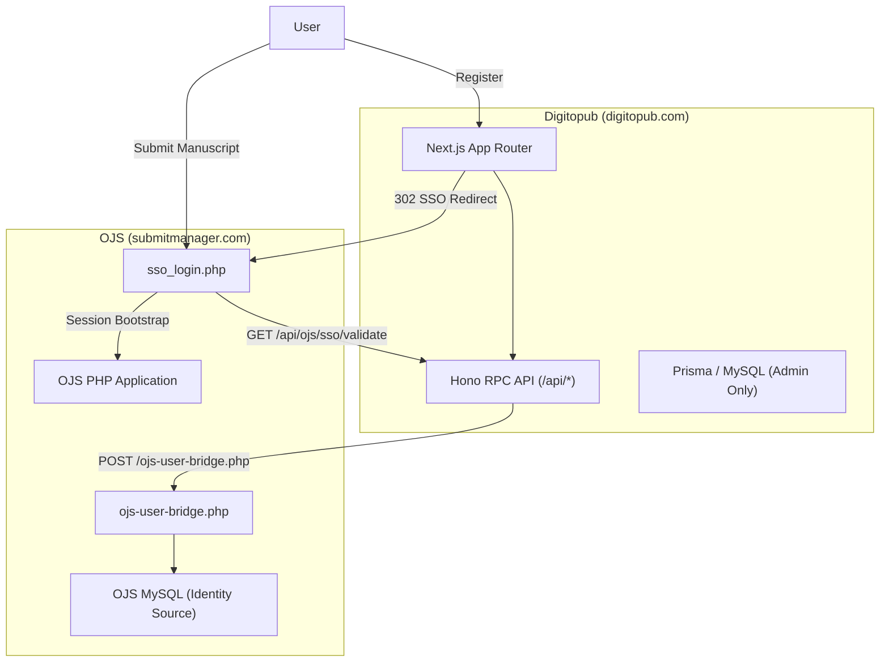
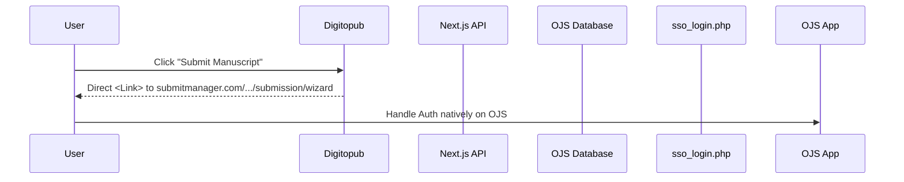
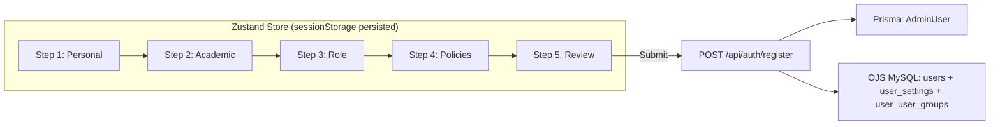
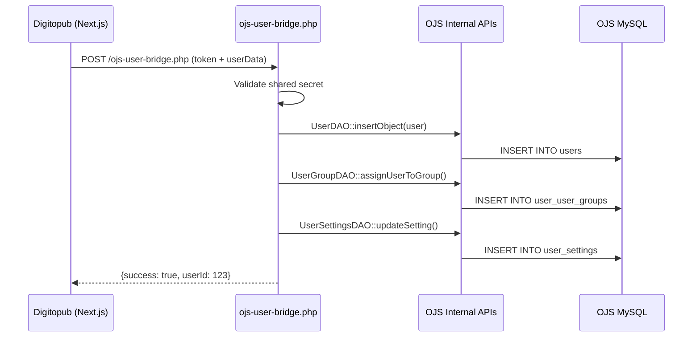

# Digitopub × OJS Platform — System Analysis & Implementation Plan

> **Updated 2026-03-15**: Incorporated OJS REST API research and user feedback.

## 1. System Architecture Overview



**Key architectural facts:**
- Digitopub uses its own `AdminUser` table (Prisma) for primary authentication
- OJS integration is **read-only via `ojs-client`** ([ojs-client.ts](file:///home/glitch/Documents/Next.JS/scientific-journals-website/src/features/ojs/server/ojs-client.ts)) using configuration via `OJS_DATABASE_*` environment variables
- SSO is token-based: Digitopub generates a one-time token → OJS PHP receiver validates & creates native session
- Users auto-provisioned into OJS on first SSO redirect (username + dummy password)

---

## 2. OJS Database Schema Analysis

### 2.1 User Tables

| Table | Purpose | Key Columns |
|-------|---------|-------------|
| `users` | Core user records | `user_id`, `username` (varchar 32), `password` (varchar 255), `email`, `country`, `locales` (JSON array), `date_registered`, `date_validated`, `disabled` |
| `user_settings` | Localized user metadata (EAV) | `user_id`, `locale`, `setting_name`, `setting_value` — stores `givenName`, `familyName`, `affiliation`, `biography`, `orcid` |
| `user_groups` | Role definitions per journal | `user_group_id`, `context_id` (journal_id), `role_id`, `permit_self_registration`, `permit_metadata_edit` |
| `user_user_groups` | User ↔ Role mapping | `user_group_id`, `user_id`, `date_start`, `date_end` |
| `user_interests` | Research interests | `user_id`, `controlled_vocab_entry_id` |

### 2.2 OJS Role IDs (Standard)

| `role_id` | Role Name | Description |
|-----------|-----------|-------------|
| `0x00000001` (1) | Site Admin | Full OJS system access |
| `0x00000010` (16) | Journal Manager | Full journal management |
| `0x00000100` (256) | Editor | Editorial workflow |
| `0x00000200` (512) | Section Editor | Section-level editorial |
| `0x00001000` (4096) | Reviewer | Peer review |
| `0x00004000` (16384) | Assistant | Editorial assistant |
| `0x00010000` (65536) | Author | Manuscript submission |
| `0x00100000` (1048576) | Reader | Read-only access |

> [!IMPORTANT]
> The `user_groups` table uses `context_id` to scope roles to specific journals. A user can have different roles in different journals (e.g., Author in Journal A, Reviewer in Journal B).

### 2.3 Journal Tables

| Table | Purpose | Key Columns |
|-------|---------|-------------|
| `journals` | Core journal records | `journal_id`, `path` (URL slug), `primary_locale`, `enabled`, `seq` |
| `journal_settings` | All journal metadata (EAV) | `journal_id`, `locale`, `setting_name`, `setting_value` — stores `name`, `acronym`, `description`, `onlineIssn`, `printIssn`, `publisherInstitution`, `contactEmail`, `contactName`, `mailingAddress`, `supportEmail`, `copyrightNotice`, `privacyStatement`, `authorGuidelines`, `openAccessPolicy` |

### 2.4 Submission Workflow Tables

| Table | Purpose |
|-------|---------|
| `submissions` | `context_id` (journal), `stage_id`, `status`, `submission_progress` |
| `publications` | Versioned publication metadata |
| `publication_settings` | Title, abstract (EAV) per locale |
| `review_assignments` | Reviewer assignments with deadlines |
| `review_rounds` | Peer review rounds per submission |
| `submission_files` | Uploaded files with `file_stage` |

---

## 3. SSO Authentication Flow (End-to-End)



### Current SSO Gaps Identified

1.  **No role assignment on auto-provision**: When a user is auto-created in OJS ([sso-route.ts](src/features/ojs/server/sso-route.ts) L50-61), they are only inserted into `users` — no `user_user_groups` record is created, meaning they have **no roles** in OJS
2.  **No `user_settings` populated**: OJS requires `givenName`/`familyName` in `user_settings` — these are not set during auto-provision
3.  **No country field**: OJS `users.country` is left NULL during auto-provision

---

## 4. Current Registration System Analysis

### What exists: [app/register/page.tsx](app/register/page.tsx)

- Single-step form: firstName, lastName, email, role (dropdown), password, confirmPassword, agreeToTerms
- Uses React Hook Form + Zod (`registerFormSchema`)
- Submits to `POST /api/auth/register` which creates `AdminUser` in Prisma + generates OTP
- **Role field is decorative** — collected in form but only hardcoded `"author"` is passed to [createUser()](lib/db/users.ts#4-18)
- No OJS-specific fields collected: country, affiliation, locales, ORCID, biography, research interests
- No multi-step flow
- No bilingual (Arabic/English) support

### What exists: [app/login/page.tsx](app/login/page.tsx)

- Server component that extracts `returnUrl` and optional `journalPath` from search params
- Fetches journal branding (title, logo) from Prisma when journal-specific login
- Delegates to [LoginForm](src/features/auth/components/login-form.tsx#19-140) client component
- Login triggers OTP flow (email + password → verify code → JWT session)
- Functional but minimal — no bilingual labels, no clear "journal submission system" messaging

### What exists: Auth schemas ([auth-schema.ts](src/features/auth/schemas/auth-schema.ts))

- `loginSchema`: email + password
- `registerSchema`: email + password + fullName (API-level)
- `registerFormSchema`: firstName + lastName + email + password + confirmPassword + role + agreeToTerms (form-level)

---

## 5. Gap Analysis

| Area | Current State | Required State |
|------|--------------|----------------|
| Registration fields | 7 fields (basic) | 15+ fields (OJS-compatible) |
| Role assignment | Decorative, hardcoded `"author"` | Real OJS role assignment (`user_user_groups`) |
| OJS user provisioning | Email + username only | Full user record + settings + roles |
| Country/Locale | Not collected | Required by OJS `users.country` |
| Affiliation | Not collected | Required by OJS `user_settings` |
| Journal association | Not supported | Required for role scoping |
| Policy agreements | Generic ToS checkbox | Publishing ethics, copyright, privacy per OJS |
| Journal registration | Not implemented | Multi-step wizard needed |
| Form persistence | No | Zustand persist required for multi-step |
| Bilingual UI | English only | Arabic + English needed |

---

## User Review Required

> [!IMPORTANT]
> **OJS Integration Strategy — Research Findings**: After thorough research, OJS 3.x REST API **does NOT provide endpoints for user creation, role assignment, or journal creation**. The API covers submissions, DOIs, contexts, files, and institutions only. OJS 3.5 further removed direct user creation from the UI (replaced with invitation flow). See Section 10 below for the recommended **PHP Bridge** approach.
> [!WARNING]
> **Breaking change to registration flow**: The proposed multi-step registration will fundamentally change [app/register/page.tsx](file:///home/glitch/Documents/Next.JS/scientific-journals-website/app/register/page.tsx) from a single form to a step-based wizard. The existing `registerFormSchema` and `registerSchema` will be replaced with per-step Zod schemas. Existing tests in [auth-schema.test.ts](file:///home/glitch/Documents/Next.JS/scientific-journals-website/tests/unit/auth-schema.test.ts) will need updates.

---

## 6. Proposed Changes

### Component 1: Multi-Step Registration System

#### [NEW] [registration-store.ts](src/features/auth/stores/registration-store.ts)

Zustand store with `persist` middleware (sessionStorage) managing all registration step data:
- `step` (current step index)
- `personalInfo` (firstName, lastName, email, password, country, phone)
- `academicInfo` (affiliation, department, orcid, biography, researchInterests)
- `roleSelection` (primaryRole, journalAssociations)
- `policyAgreements` (termsOfService, privacyPolicy, publishingEthics, copyrightAgreement)
- Actions: `setStep()`, `updateStepData()`, `reset()`, `isStepValid()`

#### [NEW] [registration-schemas.ts](src/features/auth/schemas/registration-schemas.ts)

Per-step Zod validation schemas:
- `personalInfoSchema` — email, firstName, lastName, password, confirmPassword, country (ISO 3166-1), phone (optional)
- `academicInfoSchema` — affiliation, department (optional), orcid (optional, validated format), biography (optional)
- `roleSelectionSchema` — primaryRole enum (author|reviewer|editor|reader), optionally selected journals[]
- `policyAgreementsSchema` — termsOfService (boolean), privacyPolicy (boolean), publishingEthics (boolean)

#### [NEW] Step components under `src/features/auth/components/register/`

- `step-personal-info.tsx` — name, email, password, country dropdown
- `step-academic-info.tsx` — affiliation, department, ORCID, biography
- `step-role-selection.tsx` — role radio buttons + optional journal association
- `step-policy-agreements.tsx` — checkboxes with expandable policy text
- `step-review-submit.tsx` — summary card of all entered data + submit button
- `registration-wizard.tsx` — orchestrator with progress bar, step navigation
- `registration-progress.tsx` — visual step indicator component

#### [MODIFY] [page.tsx](app/register/page.tsx)

Replace single-form with `<RegistrationWizard />` component. The page becomes a thin wrapper.

#### [MODIFY] [route.ts](src/features/auth/server/route.ts)

Update `POST /auth/register` to:
1. Accept expanded payload (all step data)
2. Create `AdminUser` in Prisma with extended fields
3. Auto-provision OJS user with full data (country, locales)
4. Insert `user_settings` records (givenName, familyName, affiliation, biography)
5. Insert `user_user_groups` record (role assignment for default/selected journal)
6. Return success with OTP flow

#### [MODIFY] [auth-schema.ts](src/features/auth/schemas/auth-schema.ts)

Update `registerSchema` (API-level) to accept the full expanded payload from multi-step form.

#### [MODIFY] [index.ts](src/features/auth/index.ts)

Export new schemas, store, and types.

---

### Component 2: Journal Registration Wizard

#### [NEW] [journal-registration-store.ts](src/features/journals/stores/journal-registration-store.ts)

Zustand store with `persist` middleware for multi-step journal registration:
- `publisherInfo` (name, institution, country, contactEmail, website)
- `journalInfo` (title, abbreviation, issn, eissn, discipline, keywords)
- `editorialInfo` (editorInChief, editorialBoardContact, editorialAddress)
- `publicationDetails` (frequency, peerReviewPolicy, openAccessPolicy, language)
- `technicalConfig` (websiteUrl, ojsPath, submissionWorkflow)
- `termsAgreements` (ethicsConfirmation, copyrightAcceptance, platformPolicy)

#### [NEW] [journal-registration-schemas.ts](src/features/journals/schemas/journal-registration-schemas.ts)

Per-step validation including ISSN format (`^\d{4}-\d{3}[\dxX]$`), URL validation, and file constraints.

#### [NEW] Step components under `src/features/journals/components/register/`

- `step-publisher-info.tsx`
- `step-journal-info.tsx`
- `step-editorial-info.tsx`
- `step-publication-details.tsx`
- `step-technical-config.tsx`
- `step-terms-agreements.tsx`
- `step-review-submit.tsx`
- `journal-registration-wizard.tsx`
- `journal-registration-progress.tsx`

#### [NEW] [page.tsx](app/journals/register/page.tsx)

New page route for journal registration wizard.

#### [MODIFY] [routes.ts](config/routes.ts)

Add `/journals/register` to appropriate route list (admin-protected or public depending on requirements).

---

### Component 3: Login Page Improvements

#### [MODIFY] [login-form.tsx](src/features/auth/components/login-form.tsx)

- Add journal-centric messaging ("Sign in to submit manuscripts, review papers, and manage journals")
- Add role-aware callout icons (Author / Reviewer / Editor)
- Improve visual hierarchy and branding

#### [MODIFY] [page.tsx](app/login/page.tsx)

- Improve layout and visual design
- Better SSO context communication

---

### Component 4: OJS Integration Enhancements

#### [MODIFY] [sso-route.ts](src/features/ojs/server/sso-route.ts)

Fix auto-provisioning to include:
1. Set `users.country` from registration data
2. Insert `user_settings` rows for `givenName`, `familyName`, `affiliation`
3. Insert `user_user_groups` row mapping user to Author role for the target journal

#### [NEW] [ojs-user-bridge.php](submit-manager-database-schema-ojs/ojs-user-bridge.php)

PHP bridge script (deployed alongside [sso_login.php](submit-manager-database-schema-ojs/sso_login.php) on OJS server) that uses OJS internal DAOs for safe user operations:
- `action=create_user` — creates user via `UserDAO`, inserts `user_settings`, assigns roles via `UserGroupDAO`
- `action=assign_role` — adds `user_user_groups` entry using OJS internal APIs
- `action=get_user_groups` — lists available role groups for a given journal context
- Protected by shared secret token validation (same pattern as SSO)

#### [NEW] [ojs-user-service.ts](src/features/ojs/server/ojs-user-service.ts)

TypeScript service layer that calls the PHP bridge via HTTP (not direct MySQL):
- `provisionOjsUser(email, userData)` — calls PHP bridge `action=create_user`
- `assignOjsRole(userId, journalId, roleId)` — calls PHP bridge `action=assign_role`
- Falls back to direct MySQL via [ojsQuery()](src/features/ojs/server/ojs-client.ts#54-98) if PHP bridge is unavailable (graceful degradation)

---

## 7. Database Fields Required for OJS Registration

### Minimum from Digitopub registration:

| Digitopub Form Field | OJS Target Table | OJS Column / Setting Name |
|----------------------|-------------------|--------------------------|
| firstName | `user_settings` | `givenName` (per locale) |
| lastName | `user_settings` | `familyName` (per locale) |
| email | `users` | `email` |
| password | `users` | `password` (bcrypt hash) |
| country | `users` | `country` (ISO 3166) |
| affiliation | `user_settings` | `affiliation` (per locale) |
| role | `user_user_groups` | Maps to `user_group_id` → `role_id` |
| locales | `users` | `locales` (JSON array: `["en","ar"]`) |
| biography (optional) | `user_settings` | `biography` (per locale) |
| ORCID (optional) | `user_settings` | `orcid` |

---

## 8. State Management Design



- **Persist middleware**: `sessionStorage` (cleared on browser close, survives refresh)
- **Step validation**: Each step validated independently via its Zod schema before allowing Next
- **Step navigation**: Back/Next buttons, clickable progress indicators for completed steps only
- **Reset**: Store resets after successful submission or explicit abandon

---

## 9. Security Considerations

1. **Password handling**: Passwords never stored in sessionStorage — only in Zustand memory, cleared on submit
2. **ISSN validation**: Strict format validation prevents injection via journal registration
3. **OJS SQL injection**: Already mitigated by parameterized queries in [ojsQuery()](src/features/ojs/server/ojs-client.ts#54-98)
4. **SSO token** reuse: Atomic `updateMany` prevents TOCTOU race conditions (existing)
5. **Open redirect prevention**: [sso_login.php](submit-manager-database-schema-ojs/sso_login.php) validates redirect paths (existing)
6. **File upload limits**: Enforce on both client and server for journal cover images / policy docs

---

## 10. Integration Strategy — OJS API Research & Recommendation

### OJS REST API Capabilities (Verified)

| Area | API Support | Notes |
|------|-------------|-------|
| Submissions | ✅ Full CRUD | `POST /submissions`, `GET /submissions/{id}` |
| Publications | ✅ Read + Edit | Versioned publication management |
| DOIs | ✅ Create + Register | New in 3.4 |
| Files | ✅ Upload + Manage | `POST /temporaryFiles`, submission files |
| Institutions | ✅ CRUD | New in 3.4 |
| Contexts (Journals) | ⚠️ Read-only | GET only, no POST to create journals |
| **Users** | ❌ **No create/edit** | No `POST /users` endpoint exists |
| **Roles** | ❌ **Not available** | No role assignment API |
| **Journal Creation** | ❌ **Not available** | Admin UI only |

### Three Integration Approaches Evaluated

| Approach | Safety | Maintainability | Complexity | Verdict |
|----------|--------|----------------|------------|--------|
| **A. Read-Only via ojs-client** (current) | ⚠️ Low — bypasses OJS business logic, schema changes break it | Low — SQL scattered across routes | Low | ❌ Fragile |
| **B. PHP Bridge Scripts** | ✅ High — uses OJS `UserDAO`, `UserGroupDAO` internals | High — OJS handles schema compatibility | Medium | ✅ **Recommended** |
| **C. Custom OJS Plugin** | ✅ High — proper OJS extension point | Highest — survives OJS upgrades | High | ⚪ Future option |

### Recommended: PHP Bridge Approach (Option B)

Deploy a PHP bridge script (`ojs-user-bridge.php`) alongside existing [sso_login.php](submit-manager-database-schema-ojs/sso_login.php) on the OJS server. Benefits:

1. **Uses OJS internal APIs** (`UserDAO`, `UserGroupDAO`) — respects OJS business logic, password hashing, validation
2. **Survives OJS upgrades** — DAOs are stable internal interfaces; direct SQL is not
3. **Consistent with existing pattern** — [sso_login.php](submit-manager-database-schema-ojs/sso_login.php) already does this for sessions
4. **Secured by shared secret** — same HMAC token validation as SSO
5. **Fallback**: `ojs-user-service.ts` can degrade to direct MySQL if bridge is down



---

## Verification Plan

### Automated Tests

**Existing tests to update:**
```bash
# Run existing auth schema tests (will need updating for new schemas)
bun run test tests/unit/auth-schema.test.ts
```

**New tests to add:**

1. `tests/unit/registration-schemas.test.ts` — validates all 4 step schemas with valid/invalid data
   - Personal info: email format, password length, country ISO codes
   - Academic info: ORCID format validation, optional fields
   - Role selection: valid role enums
   - Policy agreements: all-required boolean checks

2. `tests/unit/journal-registration-schemas.test.ts` — validates all journal registration step schemas
   - ISSN format: `1234-5678` valid, `1234` invalid
   - URL validation for website/OJS URLs
   - Required vs optional field boundaries

Run all tests:
```bash
bun run test
```

### Manual Verification

1. **Registration wizard flow**: Navigate to `/register`, complete all 5 steps, verify data persists across page refresh (sessionStorage), verify form submits successfully
2. **Login page**: Navigate to `/admin/login`. Verify it redirects to `/admin/dashboard` after OTP.
3. **Journal registration**: Navigate to `/journals/register`, complete all 7 steps

> [!NOTE]
> OJS database integration testing requires a running OJS MySQL instance with `OJS_DATABASE_*` env vars configured. This should be verified manually against the staging OJS instance.
