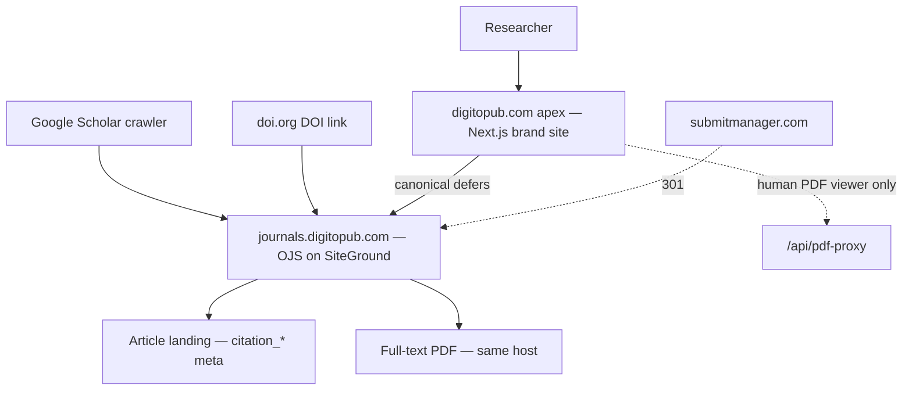

# Data Flow

Two diagrams: who reaches what once the cutover is complete, and the ordered
cutover sequence that gets us there.

---

## (a) Request flow — end state

**Reading the diagram.** Machine-readable scholarly traffic — the Google Scholar
crawler and DOI resolvers — terminates at `journals.digitopub.com`, where OJS serves
the article landing with full Highwire `citation_*` metadata and a same-host open
PDF. Human researchers land on the apex `digitopub.com`, a Next.js brand site that
markets and indexes the journals; for each article it emits no competing scholarly
metadata and sets `<link rel="canonical">` to the subdomain landing, so search
engines consolidate authority on a single host. The `/api/pdf-proxy` route remains
purely a UX affordance — a server-side fetch that lets the apex render PDFs inline
for humans — and is never exposed to crawlers. `submitmanager.com`, the old
marketing host, is a permanent 301 to the subdomain so no legacy link bleeds
authority away.

---

## (b) Cutover sequence

```mermaid
flowchart TD
  S1["1. DNS — A journals.digitopub.com → SiteGround IP &#40;invisible, reversible&#41;"]
  S2["2. SiteGround — add domain alias + Let's Encrypt SSL &#40;invisible, reversible&#41;"]
  S3["3. Verify HTTPS on subdomain serves current OJS &#40;invisible, reversible&#41;"]
  S4["4. ▶ PUBLIC PIVOT ◀ Flip OJS base_url → https://journals.digitopub.com &#43; clear caches"]
  S5["5. Apply Apache 301 — submitmanager.com → journals.digitopub.com"]
  S6["6. Re-deposit DOIs at Crossref with new article URLs"]
  S7["7. Deploy apex env &#40;OJS_BASE_URL / PUBLIC_OJS_BASE_URL&#41; → subdomain"]
  S8["8. GSC — add property, submit OJS sitemap"]
  S9["9. Run verify-cutover.sh until matrix is green; monitor Scholar recrawl"]
  S1 --> S2 --> S3 --> S4 --> S5 --> S6 --> S7 --> S8 --> S9
```

**Reading the diagram.** Steps 1–3 are **invisible and reversible**: DNS, the
SiteGround alias, and an SSL cert can be added and removed without any visitor
noticing, because OJS still emits `submitmanager.com` URLs in its HTML at that
point. Step 4 is the **public pivot** — flipping OJS `base_url` rewrites every
emitted URL to `journals.digitopub.com`; until this step the move has not happened
from a crawler's perspective. Steps 5–6 close the legacy door (301 from
`submitmanager.com`) and tell Crossref where DOIs now point. Step 7 is the only
repo-side deploy in the cutover window: the apex starts building OJS URLs against
the subdomain so the canonical, JSON-LD `sameAs`, and any server-rendered links
match what crawlers will see. Steps 8–9 are the long tail: register the property,
submit the sitemap, run the verification battery against every signal that
matters, and watch Scholar pick up the new host on its own cadence.
