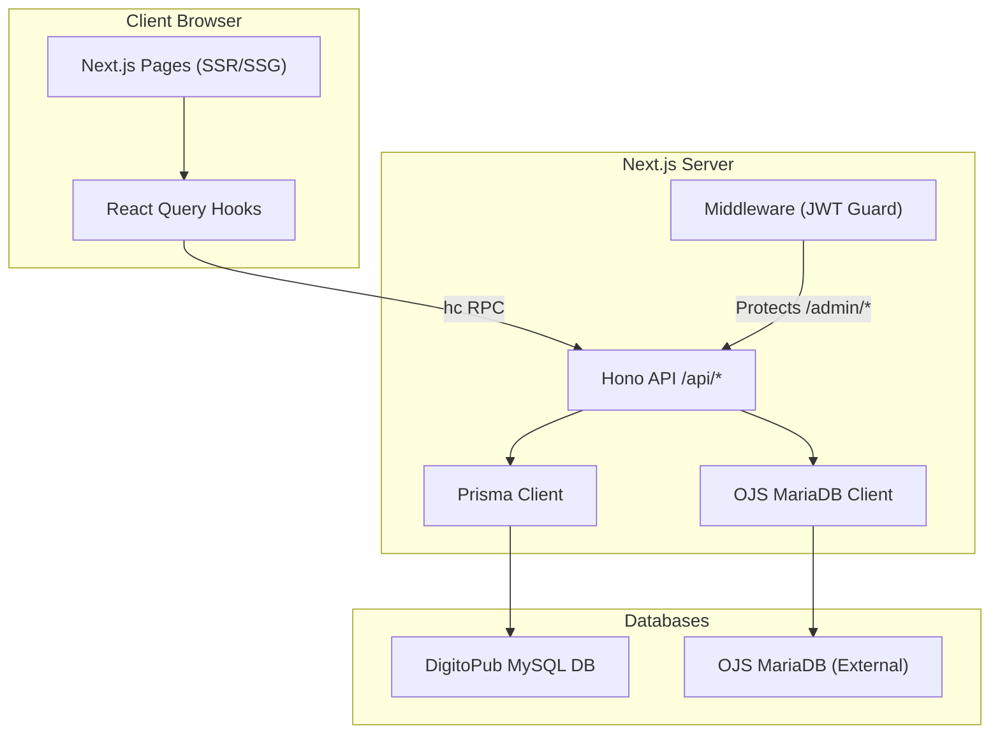
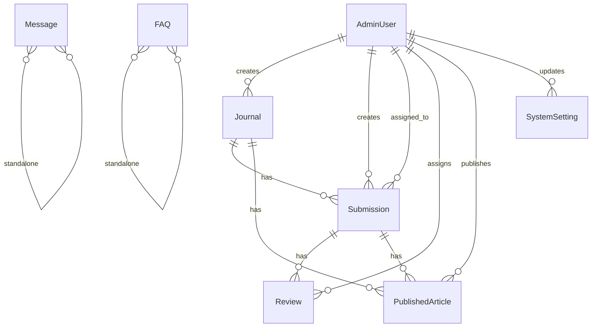
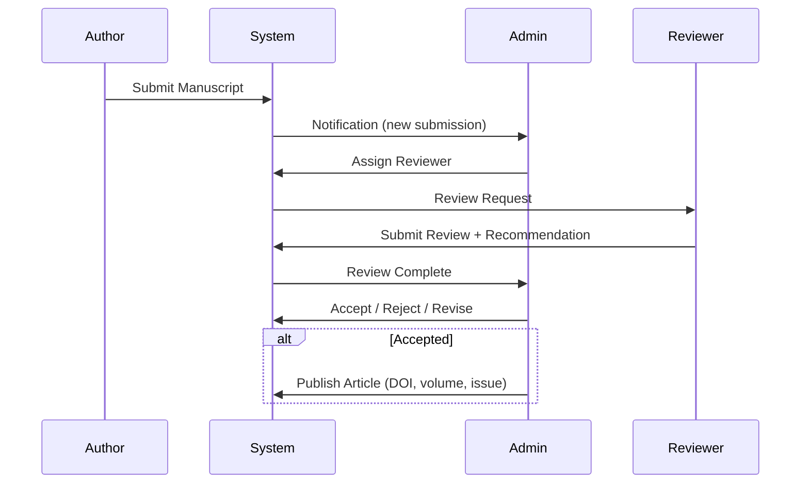

# DigitoPub — System Analysis & Technical Report

> **Project**: Scientific Journals Website (DigitoPub)
> **Date**: 2026-02-25
> **Scope**: Full system analysis, architecture review, test design, seed data, and recommendations

---

## 1. System Overview

### 1.1 Business Objective

DigitoPub is an academic journal management platform that enables:
- **Public users** to browse journals, read published articles, submit manuscripts, and contact the editorial team
- **Admin users** to manage journals, submissions, reviews, authors, analytics, FAQ/solutions, messages, and system settings
- **External Integration (MANDATORY)**: Journals, Authors, and Reviewers are strictly imported from an external MySQL database. They must not be created locally or duplicated.
- **Minimal User Set**: Only two primary system users are permitted: Super Admin and Technical Support.

### 1.2 Technology Stack

| Layer | Technology | Version |
|-------|-----------|---------|
| **Frontend** | Next.js (App Router) | 16.0.10 |
| **Bundler** | Turbopack | Built-in |
| **API** | Hono (via Next.js API routes) | — |
| **Validation** | Zod | 4.3.6 |
| **Client Hooks** | TanStack React Query | — |
| **RPC** | Hono RPC Client (`hc`) | — |
| **ORM** | Prisma (via `@prisma/adapter-mariadb`) | 7.2.0 |
| **Database** | MySQL / MariaDB | — |
| **Auth** | JWT (`jose`) + httpOnly Cookies | — |
| **Passwords** | bcryptjs (cost 10) | — |
| **Styling** | Tailwind CSS 4 + tw-animate-css | 4.2.1 |
| **UI Components** | shadcn/ui | — |
| **Hosting** | Node.js SSR (Hostinger) | ≥18.18.0 |

### 1.3 Architecture Diagram

---

## 2. Database Schema Analysis

### 2.1 Entity-Relationship Diagram

### 2.2 Model Summary

| Model | Table | Rows (Fields) | Key Relationships |
|-------|-------|---------------|-------------------|
| `AdminUser` | `admin_users` | **2 Users Only** | Super Admin & Support User; Primary system actors |
| `Journal` | `journals` | **External Only** | Synced/Linked; Not seeded locally |
| `Submission` | `submissions` | 14 + timestamps | Belongs to journal; has reviews; linked to OJS |
| `Review` | `reviews` | **External Only** | Peer review metadata; linked to external reviewers |
| `Author` | `authors` | **External Only** | Research contributors; linked to external database |
| `PublishedArticle` | `published_articles` | 12 + timestamp | Belongs to submission & journal; published by admin |
| `SystemSetting` | `system_settings` | 4 + timestamp | Key-value config; updated by admin |
| `Message` | `messages` | 7 + timestamps | standalone (contact form) |
| `FAQ` | `faq_solutions` | 7 + timestamps | standalone (help/FAQ) |

### 2.3 Data Integrity Rules

| Constraint | Description |
|-----------|-------------|
| `AdminUser.email` | Unique |
| `Journal.issn` | Unique (nullable) |
| `Journal.ojs_id` | Unique (nullable) |
| `Submission.ojs_submission_id` | Unique (nullable) |
| `PublishedArticle.doi` | Unique (nullable) |
| `PublishedArticle.ojs_publication_id` | Unique (nullable) |
| `SystemSetting.setting_key` | Unique |
| FK `Journal → AdminUser` | `onDelete: SetNull` |
| FK `Submission → Journal` | `onDelete: Cascade` |
| FK `Submission → AdminUser` | `onDelete: SetNull` |
| FK `Review → Submission` | `onDelete: Cascade` |
| FK `PublishedArticle → Submission` | `onDelete: Cascade` |
| FK `PublishedArticle → Journal` | `onDelete: Cascade` |

---

## 3. User Roles, Permissions & Workflows

### 3.1 Roles

| Role | Description | Email |
|------|------------|-------|
| **Super Admin** | Primary system administrator | `admin@digstobob.com` |
| **Support** | Technical Support / Helpdesk | `support@digstobob.com` |

### 3.2 Permission Matrix

| Resource | Public | Author | Admin |
|----------|--------|--------|-------|
| Journals — List | ✅ | ✅ | ✅ |
| Journals — Create/Edit/Delete | ❌ | ❌ | ✅ |
| Submissions — Create | ❌ | ❌ | ✅ |
| Submissions — View | ❌ | ❌ | ✅ |
| Reviews — Manage | ❌ | ❌ | ✅ |
| Messages — Send (Contact) | ✅ | ✅ | ✅ |
| Messages — View/Manage | ❌ | ❌ | ✅ |
| FAQ/Solutions — Read (published) | ✅ | ✅ | ✅ |
| FAQ/Solutions — CRUD | ❌ | ❌ | ✅ |
| System Settings | ❌ | ❌ | ✅ |
| OJS Journals | Via API | Via API | Via API |

### 3.3 Core Workflows

---

## 4. API Architecture

### 4.1 Hono Route Registry

All routes are mounted under `/api` via `app.basePath("/api")`.

| Route | Method | Auth | Description |
|-------|--------|------|-------------|
| `/api/journals` | GET | Public | List all journals |
| `/api/journals/:id` | GET | Public | Get journal by ID |
| `/api/journals` | POST | Admin | Create journal |
| `/api/journals/:id` | PATCH | Admin | Update journal |
| `/api/journals/:id` | DELETE | Admin | Delete journal |
| `/api/auth/login` | POST | Public | Login |
| `/api/auth/register` | POST | Public | Register new account |
| `/api/auth/logout` | POST | Auth | Logout |
| `/api/auth/me` | GET | Auth | Get current user |
| `/api/messages` | GET | Admin | List messages |
| `/api/messages/:id` | GET | Admin | Get message |
| `/api/messages` | POST | Public | Send contact message |
| `/api/messages/:id` | PATCH | Admin | Update message status |
| `/api/messages/:id` | DELETE | Admin | Delete message |
| `/api/solutions` | GET | Mixed | Published (public) / All (admin) |
| `/api/solutions/:id` | GET | Mixed | Published or admin-only |
| `/api/solutions` | POST | Admin | Create FAQ |
| `/api/solutions/:id` | PATCH | Admin | Update FAQ |
| `/api/solutions/:id` | DELETE | Admin | Delete FAQ |
| `/api/ojs/journals` | GET | Public | Fetch OJS journals |

### 4.2 Validation Schemas

| Schema | Fields | Key Validations |
|--------|--------|----------------|
| `loginSchema` | email, password | Email format; password min 1 |
| `registerSchema` | email, password, fullName | Email format; password min 6; name max 255 |
| `journalCreateSchema` | 13 fields | Title required; field required; ISSN max 20; fees non-negative; URLs validated |
| `messageCreateSchema` | 5 fields | Name, subject, message required; type enum (6 values) |
| `solutionCreateSchema` | 4 fields | Question and answer required; category max 100 |

---

## 5. Gap Analysis & Risks

### 5.1 Critical Issues

> [!CAUTION]
> These issues should be addressed before production launch.

| # | Issue | Severity | Detail |
|---|-------|----------|--------|
| **SEC-01** | **No role-based authorization on API routes** | 🔴 Critical | Auth-protected routes only check `getSession()` (any authenticated user). An `author` role user can create/delete journals, manage submissions, etc. No distinction between `admin` and `author` roles in API. |
| **SEC-02** | **Registration creates users in `admin_users` table** | 🔴 Critical | Public registration (`/api/auth/register`) inserts into the same table used for admins. Any registered user can access admin routes since middleware only verifies JWT existence, not role. |
| **SEC-03** | **Default admin password in seed is `admin123`** | 🟡 Medium | Weak default password hardcoded in seed script. |
| **SEC-04** | **JWT_SECRET throws at module level** | 🟡 Medium | `if (!process.env.JWT_SECRET) throw` in `auth.ts` and `middleware.ts` will crash the entire application at import time if env var is missing. Should fail gracefully or use a startup check. |
| **SEC-05** | **No rate limiting on auth endpoints** | 🟡 Medium | Login and registration have no brute-force protection. |
| **SEC-06** | **No CSRF protection** | 🟡 Medium | Cookie-based auth without CSRF tokens. `sameSite: "lax"` provides partial mitigation. |
| **SEC-07** | **`ignoreBuildErrors: true` in next.config** | 🟡 Medium | TypeScript errors are silently ignored during production builds. |

### 5.2 Architectural Gaps

| # | Gap | Impact |
|---|-----|--------|
| **ARCH-01** | **No Submission / Review / PublishedArticle / Settings API routes** | Only journals, auth, messages, solutions, and OJS routes exist. The Prisma schema defines models for submissions, reviews, published articles, and system settings but there are no corresponding API endpoints. |
| **ARCH-02** | **Missing `Submission` and `Review` feature modules** | No `src/features/submissions/` or `src/features/reviews/` directories. These core workflows are not implemented. |
| **ARCH-03** | **`full_name` not stored in JWT** | `getSession()` returns `full_name: ""` from JWT. If UI needs the name, it requires an extra DB query. |
| **ARCH-04** | **BigInt serialization is manual** | Every route has a `serialize*()` helper to convert `BigInt → string`. This should be centralized. |
| **ARCH-05** | **`updateData` uses `any` type** | PATCH handlers build `updateData` with `any` type, losing type safety. |
| **ARCH-06** | **OJS integration is read-only** | Only journal listing from OJS DB. No submission sync, article sync, or bidirectional mapping. |
| **ARCH-07** | **No pagination on list endpoints** | All list endpoints return full datasets (`findMany` without `take`/`skip`). Will fail at scale. |
| **ARCH-08** | **No file upload support** | `manuscript_file_url` and `supplementary_files` fields exist in schema but no upload endpoints. |

### 5.3 Data Model Risks

| # | Risk | Detail |
|---|------|--------|
| **DATA-01** | `Journal.submission_fee` is `Decimal` but API schema validates as `number` | Potential floating-point mismatch. Route assigns `data.submission_fee || 0` which may coerce incorrectly. |
| **DATA-02** | `Submission.keywords` and `co_authors` are `Json` | No schema validation for JSON structure. Could store arbitrary data. |
| **DATA-03** | No `soft_delete` pattern | Deleting journals cascades to all submissions, reviews, and published articles. No audit trail. |
| **DATA-04** | No `e_issn` uniqueness constraint | `e_issn` can have duplicates (unlike `issn` which is unique). |

---

## 6. Improvement Proposals

### 6.1 Security (Priority: Immediate)

1. **Implement role-based middleware** — Add a `requireRole("admin")` Hono middleware that checks `session.role` before allowing mutating operations.
2. **Separate user tables** OR **enforce role check everywhere** — Either split `admin_users` from `registered_users`, or enforce strict role checking.
3. **Add rate limiting** — Use `hono-rate-limiter` on `/api/auth/login` and `/api/auth/register` (e.g., 5 req/min per IP).
4. **Remove `ignoreBuildErrors`** — Fix all TypeScript errors and enable build-time type checking.
5. **Add CSRF tokens** — Or switch to `sameSite: "strict"`.

### 6.2 Architecture (Priority: High)

1. **Add missing feature modules**: `submissions`, `reviews`, `published-articles`, `settings`.
2. **Centralize BigInt serialization** via a Prisma middleware or shared utility.
3. **Add pagination** — Standard `?page=1&limit=20` on all list endpoints.
4. **Add file upload** — Integrate with S3-compatible storage for manuscript files.
5. **Store `full_name` in JWT** or pre-fetch on login.

### 6.3 Performance (Priority: Medium)

1. **Connection pooling** — Current `connectionLimit: 10` is fine for low traffic. Add connection health checks.
2. **Caching** — Cache public journal lists with `Cache-Control` headers or React Query `staleTime`.
3. **Lazy-load OJS pool** — Already implemented ✅.
4. **Database indexes** — Already well-defined ✅.

### 6.4 Maintainability (Priority: Medium)

1. **Remove `any` types** — Replace `updateData: any` with Prisma generated types.
2. **Add API-level logging** with request IDs for tracing.
3. **Add health check endpoint** — `GET /api/health` to verify DB connectivity.
4. **Environment validation** — Use `zod` to validate all env vars at startup.

---

## 7. Test Design

### 7.1 Unit Tests

| ID | Test Case | Module | Input | Expected Result | Priority |
|----|-----------|--------|-------|-----------------|----------|
| UT-01 | Login schema accepts valid email+password | `auth-schema` | `{email:"a@b.com", password:"123456"}` | Passes validation | High |
| UT-02 | Login schema rejects invalid email | `auth-schema` | `{email:"notanemail", password:"x"}` | Validation error on `email` | High |
| UT-03 | Register schema enforces password min 6 | `auth-schema` | `{..., password:"12345"}` | Validation error | High |
| UT-04 | Register form schema validates password match | `auth-schema` | Mismatched passwords | Error on `confirmPassword` | High |
| UT-05 | Journal create schema requires `title` and `field` | `journal-schema` | `{title:"", field:""}` | Validation errors | High |
| UT-06 | Journal ID param rejects non-numeric | `journal-schema` | `{id:"abc"}` | Validation error | Medium |
| UT-07 | Journal schema validates URL format | `journal-schema` | `{..., website_url:"notaurl"}` | Validation error | Medium |
| UT-08 | Message schema enforces required fields | `message-schema` | Missing `name` | Validation error | High |
| UT-09 | Message type enum rejects unknown values | `message-schema` | `{message_type:"unknown"}` | Validation error | Medium |
| UT-10 | Solution schema accepts valid FAQ | `solution-schema` | `{question:"Q?", answer:"A."}` | Passes | Medium |
| UT-11 | `serializeJournal` converts BigInt to string | `journal-route` | `{id: 1n}` | `{id: "1"}` | High |
| UT-12 | `bcrypt.hash` produces valid hash | `users` | `"password123"` | `$2a$10$...` format | High |
| UT-13 | `bcrypt.compare` validates correct password | `users` | Correct password vs hash | Returns `true` | High |
| UT-14 | `bcrypt.compare` rejects wrong password | `users` | Wrong password vs hash | Returns `false` | High |
| UT-15 | JWT creation and verification round-trip | `auth` | User payload | Decoded payload matches | High |
| UT-16 | JWT rejects expired tokens | `auth` | Expired JWT | Returns `null` | High |

### 7.2 Integration Tests

| ID | Test Case | Endpoint | Input | Expected | Priority |
|----|-----------|----------|-------|----------|----------|
| IT-01 | Login with valid credentials | POST `/api/auth/login` | Valid email+password | 200, `success: true`, sets cookie | 🔴 |
| IT-02 | Login with wrong password | POST `/api/auth/login` | Valid email, wrong password | 401, `success: false` | 🔴 |
| IT-03 | Login with non-existent user | POST `/api/auth/login` | Unknown email | 401 | 🔴 |
| IT-04 | Register new user | POST `/api/auth/register` | New email | 200, user created | 🔴 |
| IT-05 | Register duplicate email | POST `/api/auth/register` | Existing email | 400, duplicate error | 🔴 |
| IT-06 | Get current user (authenticated) | GET `/api/auth/me` | Valid JWT cookie | 200, user data | 🔴 |
| IT-07 | Get current user (no cookie) | GET `/api/auth/me` | No cookie | 401 | 🔴 |
| IT-08 | List journals (public) | GET `/api/journals` | None | 200, array of journals | 🟡 |
| IT-09 | Get journal by ID | GET `/api/journals/1` | Valid ID | 200, journal object | 🟡 |
| IT-10 | Get journal with non-existent ID | GET `/api/journals/99999` | Invalid ID | 404 | 🟡 |
| IT-11 | Create journal (admin) | POST `/api/journals` | Valid data + JWT | 201, journal created | 🔴 |
| IT-12 | Create journal (unauthenticated) | POST `/api/journals` | Valid data, no JWT | 401 | 🔴 |
| IT-13 | Update journal | PATCH `/api/journals/1` | Partial data + JWT | 200, updated | 🟡 |
| IT-14 | Delete journal | DELETE `/api/journals/1` | JWT | 200, deleted | 🔴 |
| IT-15 | Delete journal cascades submissions | DELETE `/api/journals/1` | Journal with submissions | Submissions also deleted | 🔴 |
| IT-16 | Send contact message (public) | POST `/api/messages` | Valid message data | 201 | 🟡 |
| IT-17 | List messages (admin only) | GET `/api/messages` | JWT | 200, message array | 🟡 |
| IT-18 | List messages (unauthenticated) | GET `/api/messages` | No JWT | 401 | 🔴 |
| IT-19 | Update message status | PATCH `/api/messages/1` | `{status: "read"}` + JWT | 200 | 🟡 |
| IT-20 | Delete message | DELETE `/api/messages/1` | JWT | 200 | 🟡 |
| IT-21 | List published solutions (public) | GET `/api/solutions` | None | Only `is_published: true` | 🟡 |
| IT-22 | List all solutions (admin) | GET `/api/solutions` | JWT | All solutions including drafts | 🟡 |
| IT-23 | Create solution (admin) | POST `/api/solutions` | FAQ data + JWT | 201 | 🟡 |
| IT-24 | OJS journals when configured | GET `/api/ojs/journals` | OJS env vars set | 200, journal list | 🟡 |
| IT-25 | OJS journals when not configured | GET `/api/ojs/journals` | No OJS env vars | 200, `configured: false`, empty data | 🟡 |

### 7.3 End-to-End Test Scenarios

| ID | Scenario | Steps | Pass Criteria |
|----|----------|-------|---------------|
| E2E-01 | Admin Login Flow | Navigate to `/admin/login` → Enter creds → Submit → Redirected to dashboard | Dashboard loads with user info |
| E2E-02 | Admin Journal CRUD | Login → Create journal → Verify in list → Edit → Verify changes → Delete → Verify removal | All operations succeed |
| E2E-03 | Public Journal Browse | Navigate to `/journals` → Click on journal → View detail page | Journal details render correctly |
| E2E-04 | Contact Form Submission | Navigate to `/contact` → Fill form → Submit → Success message | Message saved to DB; admin sees it in `/admin/messages` |
| E2E-05 | Admin redirects unauthenticated | Navigate to `/admin/dashboard` without login | Redirected to `/admin/login?redirect=/admin/dashboard` |
| E2E-06 | FAQ Management | Login → Create FAQ (unpublished) → Verify hidden from public → Publish → Verify visible | Published FAQs shown publicly |
| E2E-07 | Session Persistence | Login → Close browser → Reopen → Navigate to admin | JWT cookie maintains session (7 day expiry) |
| E2E-08 | Logout Flow | Login → Click Logout → Verify cookie deleted → Try admin page | Redirected to login |

### 7.4 Security Tests

| ID | Test Case | Expected Result |
|----|-----------|-----------------|
| SEC-T01 | SQL injection via journal title | Zod string validation prevents injection; Prisma parameterizes |
| SEC-T02 | XSS via message body | Stored XSS via messages should be sanitized on render |
| SEC-T03 | JWT tampering (modified payload) | `jose.jwtVerify()` rejects tampered tokens |
| SEC-T04 | JWT replay with expired token | Returns `null` / 401 |
| SEC-T05 | Direct access to admin API from `author` role | **CURRENTLY PASSES (BUG)** — Should return 403 |
| SEC-T06 | Password hash not exposed in API responses | Verify `password_hash` excluded from all responses |
| SEC-T07 | CORS rejects unauthorized origins | `origin` callback returns `null` for non-allowed origins |

### 7.5 Performance Tests

| ID | Test Case | Metric | Target |
|----|-----------|--------|--------|
| PT-01 | List 1000 journals | Response time | < 500ms |
| PT-02 | Concurrent 100 login requests | Throughput | > 50 req/s |
| PT-03 | Concurrent 200 contact submissions | Error rate | < 1% |
| PT-04 | OJS query with 500 journals | Response time | < 2s |
| PT-05 | Database connection pool exhaustion | Graceful error handling | No crashes; returns 503 |

---

## 8. Seed Data Design

### 8.1 Strategy & Rationale

The seed data is designed to:
1. **Cover all 8 models** with realistic, interrelated data
2. **Test all user roles**: 1 superadmin, 2 admins, 2 editors, 3 authors
3. **Support the full submission lifecycle**: submitted → under_review → accepted → published
4. **Include edge cases**: unpublished FAQs, unread/read/archived messages, inactive journals
5. **Provide volume**: enough records to test pagination and search while remaining manageable

| Model | Record Count | Rationale |
|-------|-------------|-----------|
| AdminUser | 2 | Minimal: admin@digstobob.com and support@digstobob.com |
| Journal | 0 | **EXTERNAL DATA SOURCE** — Do not seed |
| Submission | 0 | **EXTERNAL DATA SOURCE** — Do not seed |
| Review | 0 | **EXTERNAL DATA SOURCE** — Do not seed |
| SystemSetting | 2 | Min config (site_name, contact_email) |
| Message | 0 | Not required for initialization |
| FAQ | 2 | Core support articles only |

### 8.2 Prisma Seed Script

See generated file: [seed.ts](file:///d:/scientific-journals-website/prisma/seed.ts)

---

## 9. Risks & Limitations

| # | Risk | Likelihood | Impact | Mitigation |
|---|------|-----------|--------|------------|
| R-01 | Author role can access admin APIs | High | 🔴 Critical | Implement role-based auth middleware |
| R-02 | No pagination causes memory issues at scale | Medium | 🟡 High | Add `take`/`skip` to all list endpoints |
| R-03 | OJS database connection may timeout | Medium | 🟡 Medium | Already has `idleTimeout: 30000` ✅; add retry logic |
| R-04 | Cascade deletes may destroy data | Low | 🔴 Critical | Add soft-delete pattern; confirm dialogs in UI |
| R-05 | `ignoreBuildErrors` hides production bugs | High | 🟡 High | Remove flag; fix all TS errors |
| R-06 | No backup strategy for DB | Medium | 🔴 Critical | Implement automated daily backups |
| R-07 | Missing feature modules (submissions, reviews) | — | 🟡 High | Implement before full production launch |
| R-08 | Single database region | Low | 🟡 Medium | Consider read replicas for scalability |

---

## 10. Recommendations Summary

### Immediate (Before Launch)

1. ✅ **Fix role-based authorization** — Add `requireAdmin()` middleware to all mutating endpoints
2. ✅ **Remove `ignoreBuildErrors: true`** — Fix TypeScript errors properly
3. ✅ **Add rate limiting** on auth endpoints
4. ✅ **Run comprehensive seed data** for demo and testing
5. ✅ **Add pagination** to all list endpoints

### Short-Term (Sprint 1-2)

6. Implement `submissions` and `reviews` feature modules
7. Add file upload for manuscripts (S3 / local storage)
8. Add health check endpoint (`GET /api/health`)
9. Environment variable validation via Zod at startup
10. Add structured logging with request IDs

### Medium-Term (Sprint 3-4)

11. Email notifications (submission status changes, review assignments)
12. Full OJS bidirectional sync (push published articles back to OJS)
13. Dashboard analytics with real-time metrics
14. API versioning strategy (`/api/v1/`)
15. Automated backup strategy
