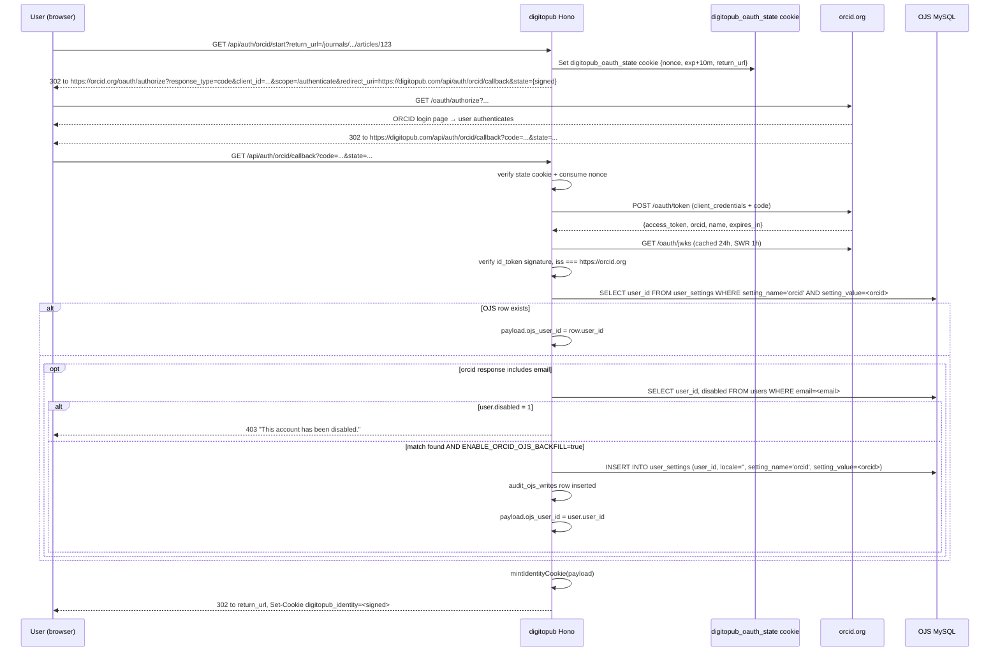

# Implementation Plan: UIET-P1 — ORCID Identity, Engagement Tracking, OA-Aware PDF Gating

**Branch**: `claude/orcid-engagement-tracking-NCXoW` | **Date**: 2026-05-12 | **Spec**: [./spec.md](./spec.md)
**Input**: Feature specification from `specs/UIET-P1/spec.md`; Phase 0 analysis from `specs/UIET-P1/analysis.md`; reviewer resolutions O-1 … O-8 plus additions A1 … A6.

## Summary

Introduce a public-user identity layer to digitopub backed by ORCID OAuth. Mint a self-contained, HMAC-signed identity cookie that is parallel to (and never entangled with) the admin `auth_token` JWT. Gate non-OA PDF views and downloads behind that identity. Record every reader engagement (view, download, citation export) into a dedicated metrics pipeline that respects a globally-displayed consent banner. Expose self-service stats and data deletion for the right-to-erasure path. Amend the constitution in the same PR to reflect that digitopub now holds ORCID-derived public identity (and ONLY that — never passwords, never OJS-owned credentials).

## Technical Context

**Language/Version**: TypeScript 5.x on Node ≥ 18.18 / Bun. Next.js 16 (App Router, Turbopack).
**Primary Dependencies**: Hono (API), Zod 4 (validation), Prisma 7 (`@prisma/adapter-mariadb`), TanStack React Query 5, `jose` (HMAC + JWKS), Tailwind 4, shadcn/ui, recharts.
**Storage**: MySQL via Prisma for digitopub (`scientific_journals_db`). MariaDB (read-only) for OJS, except for the single feature-flagged `user_settings` insert.
**Testing**: Vitest (unit + integration with mocked HTTP), Playwright (E2E + mobile viewport).
**Target Platform**: Linux Node 20 SSR (Hostinger).
**Project Type**: Web application (Next.js full-stack monorepo).
**Performance Goals**: Identity cookie verify p95 < 5 ms. ORCID callback round-trip p95 < 3 s. Metrics write p95 < 50 ms. Sidebar metric merge p95 < 150 ms.
**Constraints**: First-party cookies only. No `Domain` attribute on identity/consent cookies. No `getSession()` or `jwtVerify` in any public route. The OJS database must remain effectively read-only except via the single audited backfill path.
**Scale/Scope**: ≤ 10 k DAU peak. ≤ 5 M `user_event` rows / year. ≤ 100 k ORCIDs.

## Constitution Check

*GATE: Must pass before Phase 0 research. Re-check after Phase 1 design.*

### Original constitution (pre-amendment)

| Principle | Status |
|---|---|
| digitopub.com owns ONLY admin authentication | ❌ **Will be violated** — we introduce a new (ORCID-only) public-user identity. |
| digitopub never persists public user credentials | ✅ Holds — no passwords. We persist only the ORCID iD, optional email hash, and the OJS link id. |
| Submitmanager.com (OJS) owns ALL public user identities | ⚠️ Partially shifted — OJS still owns canonical user records; digitopub now also holds an ORCID-derived *reference* identity. |
| digitopub MUST NOT check session, require login, or intercept submission | ⚠️ Modified — we now check the identity cookie on PDF actions for non-OA articles. Submission flow remains untouched (no interception). |
| Submission and editorial workflows stay with OJS | ✅ Unchanged. |

### Amendment

> digitopub holds an ORCID-derived identity cookie for public users. ORCID is the sole identity provider. digitopub never sees passwords, never validates credentials, never stores email/password tuples. OJS keeps owning admin authentication and editorial workflows.

The amendment is **enacted in this PR** by editing `CLAUDE.md`. Once enacted, the gate re-evaluates as:

### Re-evaluated constitution (post-amendment)

| Principle | Status |
|---|---|
| Sole IdP for public users = ORCID | ✅ — no other IdP wired. |
| digitopub never sees passwords or credentials | ✅ — no `password` field touched anywhere in new code; ORCID OAuth never returns passwords. |
| OJS owns editorial workflows | ✅ — submission flow untouched. |
| Submission button never blocks on identity | ✅ — confirmed in code review during Phase 4. |
| OJS database remains effectively read-only | ✅ — single feature-flagged, audited write path; default OFF in production. |

**GATE: PASS** after amendment is applied. No further violations; no Complexity Tracking entries required.

## Project Structure

### Documentation (this feature)

```text
specs/UIET-P1/
├── analysis.md             # Phase 0 analysis (DONE)
├── spec.md                 # Phase 1 spec (DONE)
├── plan.md                 # This file
├── data-model.md           # Phase 1 (next)
├── contracts/              # Phase 1 (next)
│   ├── auth-orcid.yaml
│   ├── metrics.yaml
│   └── account.yaml
├── tasks.md                # Phase 2 (next)
└── (research.md, quickstart.md — not required for this feature)
```

### Source Code (repository root)

```text
src/
├── lib/
│   ├── identity-cookie.ts   # NEW — mint/verify/getIdentity (sliding+absolute expiry)
│   ├── orcid-oauth.ts       # NEW — authorize URL, code exchange, JWKS cache
│   ├── consent.ts           # NEW — getConsent/setConsent + dismiss tracking
│   ├── event-recorder.ts    # NEW — recordEvent with dedup rules
│   ├── ip-hash.ts           # NEW — daily-rotating salted SHA-256
│   ├── orcid-state.ts       # NEW — OAuth state token mint/verify
│   ├── ojs-write-guard.ts   # NEW — feature flag + audit wrapper for OJS writes
│   ├── auth-middleware.ts   # EXISTING (admin only) — untouched
│   └── db/auth.ts           # EXISTING (admin only) — untouched
├── server/
│   ├── app.ts               # MODIFY — mount new routers
│   └── routes/              # NEW directory for new aggregated routers
│       ├── auth-orcid.ts
│       ├── metrics.ts
│       └── account.ts
└── features/
    ├── journals/server/
    │   └── article-detail-service.ts  # MODIFY — merge OJS + digitopub totals
    └── (existing features) — untouched

app/
├── layout.tsx               # MODIFY — render <ConsentBanner /> globally
├── account/
│   ├── stats/page.tsx       # NEW
│   └── data/page.tsx        # NEW
├── api/
│   ├── pdf-proxy/route.ts   # MODIFY — gate non-OA on identity cookie
│   └── auth/[[...orcid]]/   # NEW — Hono catch-all? Or we keep all auth under existing /api/[[...route]]
└── journals/[id]/articles/[publicationId]/components/
    ├── pdf/use-pdf-modal.ts # MODIFY — fire view event, gate openModal
    ├── pdf/pdf-modal-overlay.tsx  # MODIFY — wrap downloads with useGatedAction
    ├── citation-box.tsx     # MODIFY — fire citation event
    └── article-page-client.tsx     # MODIFY — fire page-view event

components/
├── consent-banner.tsx       # NEW
└── auth/
    └── login-modal.tsx      # NEW

hooks/
├── use-gated-action.ts      # NEW
└── use-identity.ts          # NEW

prisma/
├── schema.prisma            # MODIFY — add 7 new models
└── migrations/{timestamp}_uiet_p1_engagement_tracking/migration.sql

scripts/
└── backfill-ojs-metrics.ts  # NEW — one-shot OJS metrics seed

tests/
├── unit/
│   ├── identity-cookie.test.ts
│   ├── orcid-oauth.test.ts
│   ├── consent.test.ts
│   ├── event-recorder.test.ts
│   ├── ip-hash.test.ts
│   └── orcid-state.test.ts
├── integration/
│   ├── auth-orcid.test.ts
│   ├── metrics.test.ts
│   ├── account.test.ts
│   └── pdf-proxy-gating.test.ts
└── e2e/
    ├── oa-anonymous-flow.spec.ts
    ├── non-oa-orcid-flow.spec.ts
    ├── consent-banner.spec.ts
    └── mobile-viewports.spec.ts
```

**Structure Decision**: Single-project, feature-based layout (continues the existing convention in `src/features/*`). The new logic lives in `src/lib/*` (pure functions, easy to unit-test) and a new `src/server/routes/` directory grouping cross-cutting public routes (auth-orcid, metrics, account). The article UI surfaces are modified in place. No additional packages.

---

## Technical Design

### 1. ORCID OAuth Flow



**Authorize URL construction**:

```ts
const url = new URL('https://orcid.org/oauth/authorize')
url.searchParams.set('response_type', 'code')
url.searchParams.set('client_id', process.env.ORCID_CLIENT_ID!)
url.searchParams.set('scope', '/authenticate')
url.searchParams.set('redirect_uri', process.env.ORCID_REDIRECT_URI!)
url.searchParams.set('state', orcidState.mint({ return_url, nonce }))
```

**Token verification** (`verifyOrcidToken`):
- `jose.jwtVerify(idToken, jwks)` where `jwks` is `createRemoteJWKSet(new URL('https://orcid.org/oauth/jwks'))` wrapped with a 24h-cached + 1h-SWR local store.
- Assert `payload.iss === 'https://orcid.org'`.
- Assert `payload.aud === ORCID_CLIENT_ID`.
- Assert `payload.exp > now - 120s` (±2 min skew).
- Extract `orcid = payload.sub` (ORCID iDs are the JWT `sub`).

### 2. Identity Cookie

Encoding: `base64url(JSON(payload)) + '.' + base64url(HMAC_SHA256(<above>, IDENTITY_COOKIE_SECRET))`.

Payload fields:

```ts
type IdentityPayload = {
  orcid: string             // "0000-0001-2345-6789"
  ojs_user_id: number | null
  email_hash: string | null  // SHA-256(lowercase email), if email scope granted
  iat: number               // unix seconds
  exp_sliding: number       // unix seconds, advance to now+30min on each verify
  exp_absolute: number      // unix seconds, iat+8h, never advances
  version: 1
}
```

Cookie flags: `httpOnly; Secure; SameSite=Lax; Path=/`. No `Domain`.

`verifyCookie(value)`:
1. Split on `.`; reject if not two parts.
2. Recompute HMAC over the payload segment; reject on mismatch.
3. JSON-parse the payload; reject on schema mismatch (Zod).
4. `now = epoch seconds`. Reject if `now > exp_absolute + 120` or `now > exp_sliding + 120`.
5. If `now > exp_sliding - 300` (i.e., within 5 min of sliding expiry) AND `now + 1800 < exp_absolute`, return `{payload, refreshNeeded: true}` so the caller can re-mint.
6. Return `{payload, refreshNeeded: false}`.

`getIdentity(request)` is the only public helper:

```ts
async function getIdentity(req: Request): Promise<{
  orcid: string
  ojs_user_id: number | null
  email_hash: string | null
  refreshNeeded: boolean
} | null>
```

### 3. OJS Linkage and Backfill

Order of operations on callback:
1. ORCID iD match against OJS `user_settings`. Cheap, indexed.
2. If no match AND email is in scope, email match against OJS `users.email` (case-insensitive).
3. If email match AND `users.disabled = 1` → block login (FR-019).
4. If email match AND `ENABLE_ORCID_OJS_BACKFILL=true` → INSERT `user_settings` row. Wrap in a transaction with the audit write so we never have an unaudited write.
5. If email match AND backfill flag is OFF → store the link only on the digitopub side in `user_orcid_links`. The next time the flag is flipped ON, a separate maintenance job can drain pending links.

Pseudocode:

```ts
async function linkOjsUser(orcid: string, email?: string, requestId: string) {
  const byOrcid = await ojsQuery(
    "SELECT user_id FROM user_settings WHERE setting_name='orcid' AND setting_value=? LIMIT 1",
    [orcid]
  )
  if (byOrcid.length > 0) return { ojs_user_id: byOrcid[0].user_id }

  if (!email) return { ojs_user_id: null }

  const byEmail = await ojsQuery(
    "SELECT user_id, disabled FROM users WHERE LOWER(email) = LOWER(?) LIMIT 1",
    [email]
  )
  if (byEmail.length === 0) return { ojs_user_id: null }
  if (byEmail[0].disabled === 1) {
    throw new BlockedAccountError("This account has been disabled. Please contact support.")
  }

  await prisma.userOrcidLink.upsert({
    where: { orcid },
    create: { orcid, ojs_user_id: BigInt(byEmail[0].user_id) },
    update: { ojs_user_id: BigInt(byEmail[0].user_id) },
  })

  if (process.env.ENABLE_ORCID_OJS_BACKFILL === "true") {
    await writeOrcidToOjsWithAudit({
      orcid,
      ojs_user_id: byEmail[0].user_id,
      requestId,
    })
  }

  return { ojs_user_id: byEmail[0].user_id }
}
```

`writeOrcidToOjsWithAudit` MUST:
1. Read `audit_ojs_writes` to confirm no prior write for `(orcid, ojs_user_id, 'user_settings.orcid')` exists.
2. INSERT INTO `audit_ojs_writes` first (request_id, planned=true).
3. INSERT INTO OJS `user_settings`.
4. UPDATE the audit row to `success=true`.
5. On any failure between 3 and 4, write a `success=false` audit and log loudly. Login proceeds anyway.

### 4. OA-Aware Gating

**Client-side** (`useGatedAction`):

```ts
function useGatedAction(action: () => void, opts: { isOpenAccess: boolean }) {
  const { identity } = useIdentity()
  return useCallback(() => {
    if (!opts.isOpenAccess && !identity) {
      openLoginModal({ return_url: window.location.href })
      return
    }
    action()
  }, [action, opts.isOpenAccess, identity])
}
```

Surfaces wrapped:
- `usePdfModal.openModal` (gates the view trigger).
- All four `<a>` tags in `pdf-modal-overlay.tsx` (toolbar download, mobile fallback x2, error-state new-tab).
- Card-style trigger in `app/journals/[id]/components/article-item.tsx` (delegates to `<ModalPdfViewer>` which already gates).

**Server-side** (`/api/pdf-proxy`):
1. Read `digitopub_identity` cookie via `getIdentity(request)`.
2. Resolve `(submissionId, galleyId) → isOpenAccess` from a TTL=5min in-memory cache. On miss, query OJS:
   ```sql
   SELECT i.access_status
   FROM publication_galleys pg
   INNER JOIN publications p ON p.publication_id = pg.publication_id
   LEFT JOIN issues i ON i.issue_id = p.issue_id
   WHERE pg.galley_id = ?
   LIMIT 1
   ```
3. If `!isOpenAccess && !identity`, return `401 { error: "ORCID_REQUIRED" }` with `WWW-Authenticate: orcid`.
4. Otherwise proceed with the existing proxy logic.

### 5. Metrics Endpoints

Common request flow:
1. Validate request body with Zod (`article_id`, `journal_id`, `source?`, `format?`, `galley_id?`).
2. Read identity cookie → `orcid` (nullable).
3. Read consent cookie → `consent` (one of `all` / `essential_only` / `pre_consent` / `forced_choice_pending`).
4. Resolve `ip_hash` and `ua_hash` per consent rules.
5. Call `recordEvent({...})`.
6. Return `{ recorded: true, deduped: boolean }`.

Idempotency keys (UNIQUE indexes):
- **View** (`event_type='view'`): UNIQUE on `(article_id, dedup_key, view_day)` where `dedup_key = COALESCE(orcid, ip_hash)` and `view_day = DATE(created_at UTC)`. On conflict → no-op + `deduped=true`.
- **Download** (`event_type='download'`): NO unique index. Software-level check: `SELECT 1 FROM user_event WHERE event_type='download' AND article_id=? AND galley_id=? AND dedup_key=? AND created_at > NOW() - INTERVAL 30 SECOND`. If found → no insert.
- **Citation** (`event_type='citation_export'`): plain insert, no dedup.

Rate limiting: existing `src/lib/rate-limiter.ts` is already present. Configure `metrics.*` keys with `60/min/ip` and `600/hour/ip`. Sliding window. 429 with `Retry-After`.

Note on the existing `/api/metrics/*` Hono route (homepage stats): the existing router lives at `src/features/metrics/server/route.ts` and serves `GET /api/metrics/` (site-wide stats). We will **rename** the new endpoints to `POST /api/metrics/events/view`, `POST /api/metrics/events/download`, `POST /api/metrics/events/citation` to avoid path collision and preserve the existing `GET /api/metrics/` behavior. The spec's "POST /api/metrics/view" naming is shorthand; the implementation will use the namespaced `/events/*` form.

### 6. Consent Banner

`digitopub_consent` cookie payload:

```ts
type ConsentPayload = {
  choice: 'all' | 'essential_only' | 'customize'
  granular?: { analytics: boolean; personalization: boolean }
  dismiss_count: number
  first_dismiss_at: number | null  // unix seconds
  decided_at: number | null        // unix seconds when a button was clicked
  version: 1
}
```

Cookie flags: `Secure; SameSite=Lax; Path=/`; expires 365 days. NOT `httpOnly` — the banner is a client component and needs to read it.

State machine:

```
[no cookie]                 → render banner (sticky, dismissible)
[choice=all|essential_only|customize] → hide banner; respect choice
[choice missing, dismiss_count < 31]  → hide banner this paint; show again next session
[choice missing, dismiss_count ≥ 31]  → render banner as modal (no dismiss)
```

UI:
- Desktop: fixed footer, three buttons inline, "Customize" expands a drawer.
- Mobile (≤640px): bottom sheet with three stacked buttons.

### 7. Retention & Aggregation

- **Hourly cron** (`scripts/metrics-aggregate.ts`): no-op for P1; placeholder.
- **Nightly cron** (UTC 02:00). MySQL/MariaDB do not support `COUNT(...) FILTER
  (WHERE ...)`; we use conditional aggregation (`CASE WHEN`) instead:
  ```sql
  INSERT INTO metrics_article_daily (article_id, journal_id, day, views, unique_views, downloads, unique_downloads, citations)
  SELECT
    article_id, journal_id, DATE(created_at) AS day,
    SUM(CASE WHEN event_type='view'     THEN 1 ELSE 0 END)                                                                AS views,
    COUNT(DISTINCT CASE WHEN event_type='view'     THEN COALESCE(orcid, ip_hash) END)                                     AS unique_views,
    SUM(CASE WHEN event_type='download' THEN 1 ELSE 0 END)                                                                AS downloads,
    COUNT(DISTINCT CASE WHEN event_type='download' THEN COALESCE(orcid, ip_hash) END)                                     AS unique_downloads,
    SUM(CASE WHEN event_type='citation_export' THEN 1 ELSE 0 END)                                                         AS citations
  FROM user_event
  WHERE created_at >= ? AND created_at < ?
  GROUP BY article_id, journal_id, DATE(created_at)
  ON DUPLICATE KEY UPDATE views=VALUES(views), unique_views=VALUES(unique_views),
    downloads=VALUES(downloads), unique_downloads=VALUES(unique_downloads),
    citations=VALUES(citations);
  ```
- **Monthly cron** (1st of month UTC 03:00): roll daily → monthly.
- **Retention cron** (weekly): `DELETE FROM user_event WHERE created_at < NOW() - INTERVAL 18 MONTH LIMIT 50000`. Repeat until 0 rows affected.

All crons are invoked via existing scripts pattern (`bun run scripts/...`). We do not introduce a new scheduler.

### 8. Sidebar Metrics Merge

Modify `article-detail-service.ts` (around the existing "5. Fetch Metrics" block):

```ts
// After OJS metrics fetch
const dpMetrics = await prisma.metricsArticleMonthly.aggregate({
  where: { article_id: BigInt(article.publication_id), journal_id: BigInt(article.journal_id) },
  _sum: { views: true, downloads: true, citations: true },
})

views += Number(dpMetrics._sum.views ?? 0)
downloads += Number(dpMetrics._sum.downloads ?? 0)
citations += Number(dpMetrics._sum.citations ?? 0)
```

The pre-launch backfill (`scripts/backfill-ojs-metrics.ts --confirm-once`) seeds `metrics_article_monthly` with one row per article dated the day before deploy, source `ojs_legacy_backfill`, so the sum is correct from day one.

### 9. Mobile Layout Strategy

- Login modal: `max-w-[420px]` on ≥641 px; full-screen drawer on ≤640 px (using a CSS media query, not JS).
- Consent banner: footer on desktop, bottom sheet on mobile via `@container` query if available, else `@media (max-width: 640px)`.
- Account stats: cards stack to single column at ≤640 px; chart switches to compact mode.
- Tested via Playwright `page.setViewportSize({ width: 360, height: 640 })`.

### 10. Environment Variables (NEW)

| Variable | Required | Default | Purpose |
|---|---|---|---|
| `ORCID_CLIENT_ID` | Yes (prod) | — | ORCID OAuth client id |
| `ORCID_CLIENT_SECRET` | Yes (prod) | — | ORCID OAuth client secret |
| `ORCID_REDIRECT_URI` | Yes (prod) | `${NEXT_PUBLIC_APP_URL}/api/auth/orcid/callback` | OAuth callback URL |
| `IDENTITY_COOKIE_SECRET` | Yes (prod) | — | HMAC secret for `digitopub_identity` |
| `EVENT_IP_HASH_SALT_SEED` | Yes (prod) | — | Seed for daily-rotating IP hash salt |
| `ENABLE_ORCID_OJS_BACKFILL` | No | `false` (prod), `true` (dev) | Opt-in to write ORCID into OJS `user_settings` |
| `ORCID_STATE_SECRET` | Yes (prod) | — | HMAC secret for OAuth state cookie (separate from identity cookie) |

All validated at startup via Zod (`src/lib/env.ts`, NEW). In production, missing values throw at boot. In dev/test, missing values fall back to a dev secret with a console warning.

### 11. Test Strategy Summary

| Layer | Coverage target | Tool |
|---|---|---|
| Unit (libs) | 90 % on each new file | Vitest |
| Integration (Hono routes) | 80 % | Vitest with mocked ORCID via `msw` |
| E2E (browser) | All 6 user stories | Playwright |
| Mobile (360×640) | All 5 new surfaces | Playwright |
| Load (sandbox) | ORCID callback p95 < 3 s | k6 or Playwright in-loop |

CI gate: `bun run lint && bun run test --coverage && grep -RE "getSession\\(\\)|jwtVerify" app/ src/server/routes/ specs/UIET-P1/contracts/ 2>/dev/null | grep -v -E "(admin|auth-middleware)" | wc -l` must equal 0.

### 12. Migration & Rollback

Migration runbook (PR body):
1. Merge to main. CI runs.
2. Deploy backend (no UI changes activated yet — feature is behind LaunchDarkly-style env flag `UIET_P1_ENABLED`).
3. Run `bunx prisma migrate deploy` against production.
4. Run `bun run scripts/backfill-ojs-metrics.ts --confirm-once` exactly once.
5. Flip `UIET_P1_ENABLED=true` to activate UI surfaces.
6. Monitor `/api/auth/orcid/callback` latency, `audit_ojs_writes` rate, and consent acceptance rate over 24h.

Rollback:
1. Flip `UIET_P1_ENABLED=false` — consent banner, login modal, and metric writes go dark. OA reading is unaffected because gating only kicks in when the flag is on.
2. If a partial-state cookie was minted during the activated window, it remains valid until its `exp_absolute`; no rollback required for cookie data.
3. To roll back schema: `bunx prisma migrate resolve --rolled-back {migration}` followed by manual SQL drop. Aggregate data is retained in case re-launch happens within the rollback window.

## Complexity Tracking

| Violation | Why Needed | Simpler Alternative Rejected Because |
|---|---|---|
| Two separate cookies (`digitopub_identity`, `digitopub_oauth_state`) | OAuth state must survive the redirect to ORCID and back; combining with identity risks accidental cross-pollination | Single cookie with both fields requires more careful clearing semantics and complicates the test matrix |
| Separate `user_orcid_links` table on digitopub side | Persists email-match results even when the OJS backfill flag is OFF; means re-flipping the flag doesn't require re-matching from scratch | Recomputing every login adds latency; OJS read is moderately expensive |
| Audit-then-write pattern for the single OJS write path | Strong guarantee that every OJS write is auditable, including failed ones | A single "after-success" audit can miss writes that succeeded in OJS but failed before the audit write |
